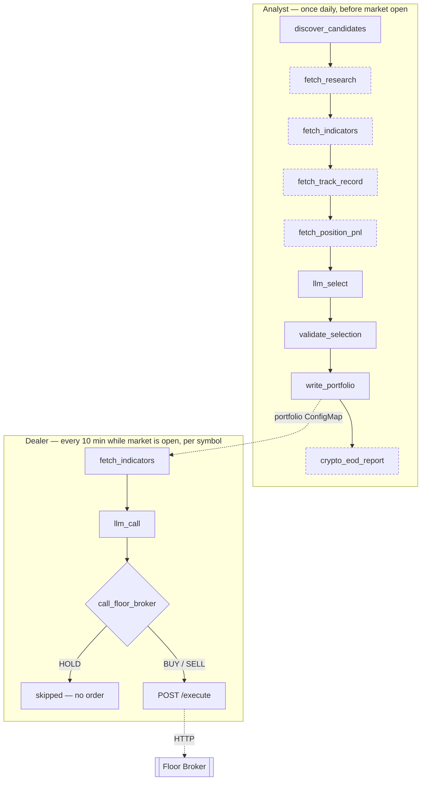

# multi-agent-ai-trader

[](https://github.com/miramar-labs-org/multi-agent-ai-trader/actions/workflows/test-lint.yaml)
[](https://github.com/miramar-labs-org/multi-agent-ai-trader/actions/workflows/build-push.yaml)
[](LICENSE)

Multi-agent AI trading system (Analyst, Dealer, Floor Broker) trading on Alpaca, powered by a locally-hosted LLM on the DGX via k3s

Trades are paper-only — see the [Alpaca paper trading dashboard](https://app.alpaca.markets/paper/dashboard/overview) for live account state, positions, and order history.

## What this is

Four independently-deployed Kubernetes workloads that together run a daily equities
trading loop against Alpaca's **paper** trading account:

- **Analyst** — a `CronJob` that runs once a day before market open, screens for candidate
  symbols, and decides a tradeable watchlist for the day.
- **Dealer** — a long-running `Deployment` that polls every 10 minutes while the market is
  open, pulls technical indicators for each watchlist symbol, and asks an LLM whether to
  BUY, HOLD, or SELL.
- **Floor Broker** — a `Deployment` + `Service` that is the only component that actually
  places orders. It never calls an LLM — it takes a BUY/SELL decision and executes it as a
  bracket order (stocks) or notional market order (crypto) on Alpaca.
- **EOD Report** — a `CronJob` that runs once a day after market close, and posts an account
  balance + trade summary to Slack. It makes no trading decisions — pure reporting.

Analyst and Dealer never talk to each other directly — Analyst writes its daily watchlist to
a shared `portfolio` ConfigMap, and Dealer reads it fresh on every poll. Dealer talks to
Floor Broker over plain in-cluster HTTP. There is no message queue or shared filesystem
anywhere in the system — Postgres exists (see [docs/architecture.md](docs/architecture.md#persistence))
but is a durable decision/event log written to alongside these calls, not a coordination
mechanism between agents. See [docs/architecture.md](docs/architecture.md) for the
full breakdown (per-agent internals, data flow, config reference, risk controls) and
[docs/platform-services.md](docs/platform-services.md) for which platform services below are
actually wired up vs. unused scaffolding.

This is a re-platforming of an earlier single-process script (`gpt-trader.py`) onto three
independently-scaled k8s workloads.

## Quickstart

Installing this on a DGX (Spark or AGX Orin) means: get an LLM served locally, get four
accounts/API keys, put them in one k8s Secret, then run the two GHA deploy workflows.

### 1. Accounts / API keys to sign up for

| Key | Where to get it | Required? |
|---|---|---|
| `ALPACA_PAPER_API_KEY` / `ALPACA_PAPER_API_SECRET` | [Alpaca](https://alpaca.markets/) — generate a **paper trading** key pair from the dashboard | Required — every component needs this |
| `TAAPI_API_KEY` | [TAAPI.io](https://taapi.io/) — free plan works (1 request/15s, see `config.yaml`'s `taapi.min_request_interval_secs`) | Required — Dealer's technical indicators |
| `LANGCHAIN_API_KEY` | [smith.langchain.com](https://smith.langchain.com/) | Optional — only if `config.yaml`'s `langsmith.enabled: true` |
| `SLACK_WEBHOOK_URL` | An [incoming webhook](https://api.slack.com/messaging/webhooks) for whatever channel you want notifications in | Optional — only if `config.yaml`'s `slack.enabled: true` |

No LLM API key is needed — the LLM is self-hosted (next step).

### 2. Serve an LLM locally on the DGX

Both Analyst and Dealer call an OpenAI-compatible endpoint at `config.yaml`'s `llm.base_url`.
This project runs [Ollama](https://ollama.com/) as a systemd service directly on the DGX host
(not inside k3s) serving `qwen3.6:35b-a3b` — see [docs/models.md](docs/models.md) for the model
choice and hardware-specific reasoning (GB10/SM121, FP8 vs NVFP4, why not vLLM). After Ollama is
up and the model is pulled, point `llm.base_url` at the host's IP, e.g.
`http://<DGX_HOST_IP>:11434/v1`.

### 3. Create the namespace + secret

`deploy.yaml` refuses to run unless `mlabs-api-keys` already exists — it's never created or
templated by CI, on purpose, so real credentials never touch a workflow file:

```sh
kubectl create namespace multi-agent-ai-trader --dry-run=client -o yaml | kubectl apply -f -

kubectl create secret generic mlabs-api-keys -n multi-agent-ai-trader \
  --from-literal=TAAPI_API_KEY=... \
  --from-literal=ALPACA_PAPER_API_KEY=... \
  --from-literal=ALPACA_PAPER_API_SECRET=... \
  --from-literal=LANGCHAIN_API_KEY=... \
  --from-literal=SLACK_WEBHOOK_URL=...
```

(see [k8s/secrets.example.yaml](k8s/secrets.example.yaml) for the canonical key list — omit
`LANGCHAIN_API_KEY`/`SLACK_WEBHOOK_URL` if you're leaving those integrations disabled.)

### 4. Review `config.yaml`

At minimum, set `llm.base_url` to your DGX's Ollama endpoint. Also worth checking:
`trading.market_override` (forces "market open" for testing outside trading hours),
`trading.enable_stocks`/`trading.enable_crypto` (independently gate equities/crypto for both
Analyst's daily candidate screening and Dealer's poll loop — crypto also merges pre-existing
positions into the watchlist), `analyst.default_budget`/`max_universe_size`, and the
`slack`/`langsmith` `enabled` flags.

### 5. Deploy

This project is GHA-only — there's no local deploy script:

```sh
gh workflow run "Build and Push" --ref main   # builds + pushes all 4 images to GHCR
gh workflow run "Deploy" --ref main           # applies k8s manifests, seeds the portfolio ConfigMap once
```

`Deploy` runs on a `[self-hosted, dgx]` GHA runner — it applies RBAC, the Analyst CronJob, the
Dealer/Floor Broker Deployments+Service, and the EOD Report CronJob, and waits for Dealer/Floor
Broker rollouts plus a Floor Broker `/healthz` smoke test before finishing.

### 6. Verify

```sh
kubectl get pods -n multi-agent-ai-trader
# Force an immediate Analyst run instead of waiting for the daily 08:55 America/New_York schedule:
kubectl create job --from=cronjob/analyst analyst-test -n multi-agent-ai-trader
kubectl logs -n multi-agent-ai-trader job/analyst-test
```

A successful run ends with `wrote portfolio with N symbols` and, if Slack is enabled, a morning
report in your configured channel. To tear everything down: `gh workflow run "Undeploy" --ref main`.

## How it decides trades

Both Analyst and Dealer make their decisions the same way: gather data, hand it to an LLM as
context, and parse the response into a strict structured-output schema (via LangChain's
`.with_structured_output()` — no hand-rolled JSON parsing). Both are implemented as small
[LangGraph](https://langchain-ai.github.io/langgraph/) state machines:

- **Analyst** (9 nodes): discover screener candidates (stocks and/or a fixed crypto watchlist,
  per `trading.enable_stocks`/`enable_crypto`) → fetch news/RSS research → fetch real TAAPI
  indicators for the top candidates by move size → fetch its own recent track record (past
  picks, Dealer decisions, Floor Broker outcomes, read from Postgres) → fetch a live unrealized
  P&L snapshot of currently-open positions → LLM picks up to 10 symbols with a budget and
  rationale each → validate each pick's exchange against the actual candidate it came from
  (dropping any hallucinated symbol) → write the `portfolio` ConfigMap → if crypto is enabled,
  post a crypto-only EOD report to Slack. News, indicators, track record, and the P&L snapshot
  are each individually feature-gated (`analyst.enable_news`/`enable_indicators`/
  `enable_track_record`/`enable_position_pnl`).
- **Dealer** (3 nodes, per symbol per poll): fetch technical indicators → LLM decides
  BUY/HOLD/SELL → if not HOLD, dispatch to Floor Broker over HTTP.



*Dashed nodes are individually feature-gated and no-op when disabled in `config.yaml`.*

Both LLM calls go through `langchain_openai.ChatOpenAI` against a single OpenAI-compatible
`base_url` shared by the whole system (`config.yaml`'s `llm.base_url`) — this points at a
locally-hosted model served by Ollama on the DGX (see `docs/models.md` for the Ollama-vs-vLLM
decision), so no external LLM API key is required for trading decisions themselves.

Floor Broker has no decision logic of its own — by the time it receives a request, the
BUY/SELL call has already been made; it only handles order placement, safety checks
(no duplicate positions), and Alpaca's order-conflict retry cases.

## External APIs used

| API | Used by | Purpose |
|---|---|---|
| [Alpaca Trading API](https://docs.alpaca.markets/) | Floor Broker | The only component that places/cancels orders — bracket orders for stocks, notional market orders for crypto. Paper account only, hardcoded (not a config toggle). |
| [Alpaca Market Data / Screener / News API](https://docs.alpaca.markets/) | Analyst, Dealer | Screener `most-actives`/`movers` endpoints and News API for Analyst's daily candidate research; live bid/ask quotes for Floor Broker's order sizing. |
| [TAAPI.io](https://taapi.io/) | Analyst, Dealer | Technical indicators (RSI, MACD, VWAP, Bollinger Bands, SMA, EMA) — Analyst for its top candidates by move size (`fetch_indicators`, capped by `analyst.indicator_fetch_limit`), Dealer for every watchlist symbol each poll. A third-party service, unrelated to any Miramar platform component. |
| Yahoo Finance RSS | Analyst | Supplementary headline research alongside Alpaca's News API. |
| [LangSmith](https://www.langchain.com/langsmith) | Analyst, Dealer | Tracing for both LangGraph agent runs (optional, `config.yaml`'s `langsmith.enabled`). This is the tracing layer actually in use — not MLflow, despite MLflow appearing in the platform endpoint table below. |
| [Slack](https://api.slack.com/messaging/webhooks) | Analyst, Dealer, Floor Broker, EOD Report | Incoming-webhook notifications for interesting events (morning report, BUY/SELL/HOLD signals, executions, EOD summary, errors) to `#miramar-trading-floor` — optional, `config.yaml`'s `slack.enabled`. |
| OpenAI-compatible LLM endpoint (Ollama on DGX) | Analyst, Dealer | Both agents' BUY/HOLD/SELL and symbol-selection decisions, served locally via Ollama (`config.yaml`'s `llm.base_url`/`llm.model`) — see `docs/models.md` for the Ollama-vs-vLLM decision. |

## Quick links

| Link | Purpose |
|---|---|
| [Alpaca paper trading dashboard](https://app.alpaca.markets/paper/dashboard/overview) | Live account state, positions, order history |
| [TAAPI.io](https://taapi.io/) | Technical indicator provider used by Dealer |
| [LangSmith](https://smith.langchain.com/) | Agent tracing — project name is `config.yaml`'s `langsmith.project` |
| [Slack incoming webhooks](https://api.slack.com/messaging/webhooks) | Notification channel: `#miramar-trading-floor` |
| Ollama | `http://<DGX_HOST_IP>:11434` — LLM inference backend, see `config.yaml`'s `llm.base_url` and [docs/models.md](docs/models.md) |
| Kubernetes dashboard | Via SSH tunnel (`ssh -L 8001:localhost:8001 <user>@spark-79b7.local`), then [http://localhost:8001/api/v1/namespaces/kubernetes-dashboard/services/http:kubernetes-dashboard:/proxy/](http://localhost:8001/api/v1/namespaces/kubernetes-dashboard/services/http:kubernetes-dashboard:/proxy/) — view the `multi-agent-ai-trader` namespace's pods/jobs |
| Postgres | No laptop tunnel — ad hoc access via `kubectl -n postgres-system exec -it deploy/postgres -- psql -U multi_agent_ai_trader -d multi_agent_ai_trader`. Stores Analyst picks, Dealer decisions, and Floor Broker events (`src/common/db.py`); backs `/analyst-explain`. See [docs/architecture.md](docs/architecture.md#persistence). |
