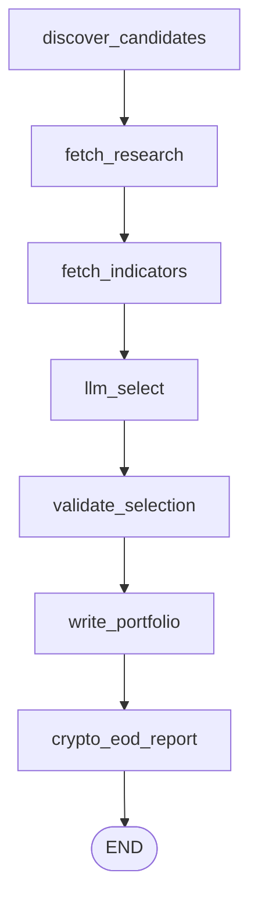
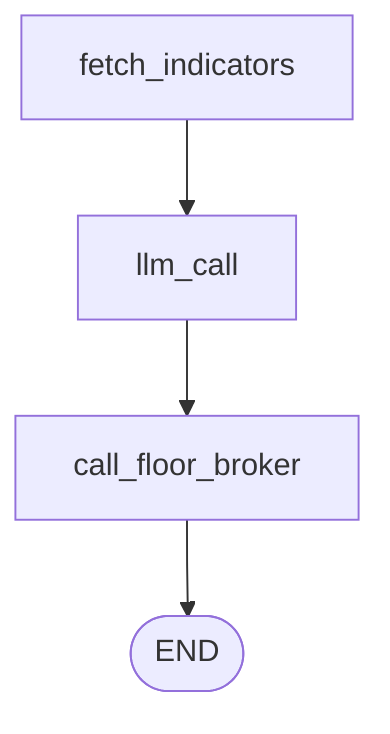

# Architecture

`multi-agent-ai-trader` is a three-agent trading floor — **Analyst**, **Dealer**, **Floor
Broker** — that trades US equities (paper account) on Alpaca, deployed as independent
Kubernetes workloads on the DGX Spark k3s cluster. It is a re-platforming of an earlier
single-process script (`gpt-trader.py`) onto three independently-scaled k8s workloads that
communicate via a shared ConfigMap and plain HTTP, rather than a monolithic loop.

```
                         06:00 UTC daily (k8s CronJob)
                         ┌─────────────────────────┐
                         │         Analyst          │
                         │  screener → news → LLM   │
                         └────────────┬─────────────┘
                                      │ writes
                                      ▼
                         ┌─────────────────────────┐
                         │  "portfolio" ConfigMap    │  ◄── no MLflow/DB, just a
                         │  {symbol, budget,        │      k8s API object
                         │   indicators, rationale} │
                         └────────────┬─────────────┘
                                      │ reads every poll
                                      ▼
                         ┌─────────────────────────┐
        every 600s  ───► │          Dealer          │  (long-running Deployment)
        while market     │ indicators → LLM signal  │
        is open          └────────────┬─────────────┘
                                      │ HTTP POST /execute
                                      │ (if action != HOLD)
                                      ▼
                         ┌─────────────────────────┐
                         │       Floor Broker        │  (Deployment + Service)
                         │  Alpaca order placement   │
                         └────────────┬─────────────┘
                                      │
                                      ▼
                              Alpaca paper account
```

Analyst and Floor Broker never talk to each other directly. There is no message queue, no
database, and no shared filesystem — the only durable state between agents is the
`portfolio` ConfigMap, and the only network hop is Dealer → Floor Broker.

Independently of that cycle, a fourth CronJob queries Alpaca directly once a day after market
close and posts a summary to Slack — it has no dependency on the ConfigMap or on Dealer/Floor
Broker's HTTP hop:

```
                         21:30 UTC Mon-Fri (k8s CronJob)
                         ┌─────────────────────────┐
                         │       EOD Report        │
                         │ account + fills → Slack │
                         └─────────────────────────┘
```

## Repo layout

```
multi-agent-ai-trader/
├── config.yaml                  # single source of config for all agents + EOD report
├── notebook.ipynb                # bare JupyterLab entry point (no pipeline logic — see below)
├── Dockerfile.analyst/.dealer/.floor-broker/.eod-report
├── k8s/                          # 2 CronJobs, 2 Deployments, 1 Service, RBAC, namespace, secrets doc
└── src/
    ├── common/                   # shared: Alpaca clients, config loader, logger, portfolio I/O, Slack
    ├── analyst/                  # CronJob — picks the tradeable universe, posts the morning report
    ├── dealer/                   # Deployment — decides BUY/HOLD/SELL per symbol
    ├── floor_broker/             # Deployment+Service — executes orders on Alpaca
    └── eod_report/                # CronJob — posts a daily account/trade summary to Slack
```

Each agent is its own Docker image and k8s workload — they scale, restart, and fail
independently. This is deliberate: Analyst runs once a day and can fail loudly without
affecting a mid-day trading loop; Dealer needs exactly one replica (`strategy: Recreate`)
to avoid two pods racing on the same portfolio; Floor Broker is a stateless request/response
service that can be replaced/restarted without losing any state (it holds none).

## Agent 1 — Analyst (`src/analyst/`)

**Workload:** `batch/v1 CronJob`, schedule `0 6 * * *` (06:00 UTC, before US market open),
`concurrencyPolicy: Forbid` (no overlapping runs), `backoffLimit: 1` — a failed research run
is meant to surface immediately, not retry-storm. Entrypoint: `python -m src.analyst.main`.

**Purpose:** once a day, decide *which symbols are worth trading today* and hand that list
off to the Dealer.

**Implementation:** a 6-node LangGraph state machine (`src/analyst/graph.py`) over an
`AnalystState`:

| Node | What it does |
|---|---|
| `discover_candidates` | when `cfg.trading.enable_stocks`, `sources.fetch_screener_candidates(screener_top_n=20)` — raw REST calls (not wrapped by `alpaca-py`) to Alpaca's `/v1beta1/screener/stocks/most-actives` and `/movers` endpoints, merged into a symbol→{volume, change_pct} dict, each tagged `market: "stocks"`. When `cfg.trading.enable_crypto`, also `sources.fetch_crypto_candidates(...)` — a fixed watchlist (`BTC/USD`, `ETH/USD`, `SOL/USD`; Alpaca's crypto screener has no most-actives equivalent) merged with `/v1beta1/screener/crypto/movers`, tagged `market: cfg.trading.crypto_taapi_exchange` |
| `fetch_research` | `sources.fetch_news(news_days=2)` (Alpaca News API, HTML stripped via BeautifulSoup) + `sources.fetch_yahoo_rss_headlines(...)` (Yahoo Finance RSS), concatenated into plain text |
| `fetch_indicators` | ranks `raw_candidates` by `abs(change_pct)` (missing values sort last) and calls `src.common.indicators.fetch_indicators_bulk` (shared with the Dealer) for the top `cfg.analyst.indicator_fetch_limit` (default 15) — one TAAPI `/bulk` POST per symbol covering `rsi, macd, vwap, bbands, sma, ema`, sleeping `cfg.taapi.min_request_interval_secs` between calls to respect TAAPI's free-tier 1-req/15s cap. At the default limit this adds ~3.75 minutes to the once-daily run — accepted as a fixed cost of a pre-market CronJob, unlike the Dealer's 10-minute poll cycle where the same rate limit is a tighter constraint. Not every candidate gets indicator data; only the top movers by size do |
| `llm_select` | the actual LLM call — see below |
| `validate_selection` | overrides each pick's `exchange` field with the `market` tag `discover_candidates` actually assigned that symbol (never trusts the LLM's own copy of `exchange`), and drops any pick whose symbol isn't in `raw_candidates` at all (a hallucination) |
| `write_portfolio` | patches the `portfolio` ConfigMap via the `kubernetes` Python client |



**LLM call:**
```python
llm = ChatOpenAI(
    base_url=cfg.llm.base_url,   # OpenAI-compatible endpoint — see platform-services.md
    api_key="not-needed",
    model=cfg.llm.model,
    temperature=cfg.llm.temperature,
).with_structured_output(PortfolioSelection)
```
The system prompt instructs the model to pick at most `max_universe_size` (10) symbols from
the candidates/research, each with a `budget` (default `default_budget`=5000), an
`indicators` list (default `[rsi, macd, vwap, bbands, sma, ema]`), and a rationale. Output is
enforced as structured JSON via `PortfolioSelection` (pydantic, `src/analyst/schema.py`) —
there is no manual JSON-parsing/regex step; LangChain's `.with_structured_output()` handles
that entirely. Each candidate the LLM sees carries a `market` field ("stocks", or a crypto
exchange name); the prompt tells it to copy that value into the pick's `exchange` field, but
`validate_selection` re-derives `exchange` from the known `market` tag regardless — the LLM's
own copy is never trusted as-is.

**Output — the `portfolio` ConfigMap** (namespace `multi-agent-ai-trader`):
```json
{
  "generated_at": "2026-08-01T06:00:03Z",
  "symbols": [
    {"symbol": "NVDA", "exchange": "stocks", "budget": 5000, "indicators": ["rsi","macd","vwap","bbands","sma","ema"], "rationale": "..."}
  ]
}
```
This is the **only** interface between Analyst and the rest of the system. No RAG, no
vector search, no MLflow logging of the selection — the "research" step is plain text
concatenation fed straight into the prompt.

Immediately after writing the ConfigMap — still inside the same CronJob pod, before market
open — `write_portfolio` also fetches the account balance (`trading_client.get_account()`) and
posts a "Morning Market Report" to Slack (`slack.notify_morning_report`): the day's picks with
budgets/rationale, plus current equity/cash/buying power. This is a by-product of the same run,
not a separate schedule — there is no dedicated Slack CronJob for it, unlike the EOD Report below.

Right after that, a `crypto_eod_report` graph node (gated on `cfg.trading.enable_crypto`) posts a
second, crypto-only "Crypto EOD Report" to Slack covering the **prior full ET calendar day's**
crypto fills/positions (`slack.notify_crypto_eod_report`). Crypto trades 24/7, so it has no market
close to hang a report off of the way stocks do — rather than a separate always-on schedule, it
piggybacks on the Analyst's existing daily 06:00 UTC run, right before the new day's picks. Uses
the same `src.common.eod.fetch_fills`/`summarize_positions` helpers as the stock EOD Report below,
filtered to crypto (`"/" in symbol`, the same convention `alpaca_client.get_current_ask_price`
already uses to distinguish crypto tickers).

## Agent 2 — Dealer (`src/dealer/`)

**Workload:** `apps/v1 Deployment`, `replicas: 1`, `strategy: {type: Recreate}` — explicitly
to prevent two Dealer pods racing to read/act on the same portfolio during a rolling update.
No ports exposed (it's a loop, not a server). Entrypoint: `python -m src.dealer.main`.

**Purpose:** continuously, while the market is open, decide BUY/HOLD/SELL for every symbol
in the current portfolio and hand non-HOLD decisions to Floor Broker.

**Main loop** (`src/dealer/main.py`):
```
while True:
    if market_is_open(cfg):              # Alpaca clock + 15-min post-open buffer
        portfolio = read_portfolio()      # fresh read of the ConfigMap every cycle, no caching
        for symbol in portfolio.symbols:
            try:
                graph.invoke(DealerState(...), config={"tags": ["dealer"]})
            except Exception:
                log_and_continue()        # one bad symbol never kills the loop/pod
    sleep(cfg.trading.pollsecs)           # 600s (10 min)
```
`market_is_open` checks `trading_client.get_clock().is_open` via Alpaca, plus a
`cfg.trading.buffer` (15 min) wait after the 9:30 ET open bell "to avoid volatility"; a
`cfg.trading.market_override` config flag can force-treat the market as open for testing.

On the open→closed transition, it also posts `slack.notify_stock_market_closed(next_open)` —
edge-detected via a module-level `_last_market_open` flag so it fires once per transition, not on
every 600s poll while the market stays closed for hours. This is distinct from EOD Report's
`notify_market_closed` (a once-daily "today wasn't a trading day" notice) — this one is Dealer's
own live status signal, so a genuinely closed market and a stuck/crashed Dealer pod are
distinguishable from Slack alone.

**Graph** (`src/dealer/graph.py`), a 3-node state machine over `DealerState`:

| Node | What it does |
|---|---|
| `fetch_indicators` | fetches every indicator configured for the symbol (or all of `cfg.indicators` if the entry says `["ALL"]`) from **TAAPI.io** — a third-party technical-analysis API, unrelated to any Miramar platform service — in a single `/bulk` POST request (`indicators.py`), and builds a natural-language indicator text block |
| `llm_call` | the decision LLM call — see below |
| `call_floor_broker` | HTTP POST to Floor Broker if action != HOLD |



**LLM call:** same pattern as Analyst — `ChatOpenAI(base_url=cfg.llm.base_url, ...).with_structured_output(Signal)`.
System prompt: *"You are an expert technical trader in stocks. Based on the values of ALL
of the indicators below, decide if you should BUY, SELL, or HOLD."* The `Signal` model
(`src/dealer/schema.py`) is `{symbol, action: BUY|HOLD|SELL, reasoning, size_hint}` —
`size_hint` (a 0–1 fraction) is captured in the schema but **not currently consumed**;
`call_floor_broker` forwards the symbol's configured `budget` unmodified regardless of
`size_hint` — except a BUY signal on a held-only entry (`budget == 0`, see
`merge_held_positions()` above), which is refused locally (`status="skipped",
reason="no_authorized_budget"`) rather than forwarded.

**Dispatch to Floor Broker** — plain in-cluster HTTP, no message queue:
```python
requests.post(f"{cfg.floor_broker.base_url}/execute", json={
    "symbol": ..., "exchange": ..., "action": ...,
    "budget": ..., "slP": cfg.trading.slP, "tpP": cfg.trading.tpP,
}, timeout=30)
```
`cfg.floor_broker.base_url` = `http://floor-broker.multi-agent-ai-trader.svc.cluster.local:8000`
— standard k8s Service DNS, not a Miramar platform endpoint. HOLD signals never leave the
Dealer pod (`execution_result = {"status": "skipped", "detail": "HOLD"}` is set locally).

On a successful response, `call_floor_broker` forwards Floor Broker's `reason`, `fill_price`,
`sl_price`, `tp_price` fields (see Floor Broker's `ExecuteResponse` below) straight through as
keyword arguments to `slack.notify_floor_broker_result`, so the Slack notice for a BUY/SELL shows
the actual fill price and TP/SL levels, not just the request Dealer sent. The error-response and
request-exception branches are unchanged — they call `notify_floor_broker_result` with only the
original 4 positional arguments, so those optional fields simply render as absent.

## Agent 3 — Floor Broker (`src/floor_broker/`)

**Workload:** `apps/v1 Deployment` + `ClusterIP Service` on port 8000. No ServiceAccount —
unlike Analyst/Dealer it never touches the k8s API (it doesn't read/write the portfolio
ConfigMap). Entrypoint: `uvicorn.run("src.floor_broker.app:app", host="0.0.0.0", port=8000)`.

**Purpose:** the only component that actually talks to Alpaca's *trading* API (Analyst and
Dealer only use Alpaca's *data*/*screener*/*news* endpoints). Purely mechanical — it never
calls an LLM.

**API** (`src/floor_broker/app.py`):
| Route | Purpose |
|---|---|
| `GET /healthz` | `{"status": "ok"}` — backs the Deployment's readiness/liveness probes |
| `POST /execute` | body: `{symbol, exchange, action: BUY\|SELL, budget, slP, tpP}` → dispatches to `execution.buy()`/`execution.sell()` |

Alpaca `APIError`s are caught and returned as `{"status": "error", "detail": ...}` (HTTP 200)
rather than raised; unexpected exceptions become a 500.

`ExecuteResponse` also carries optional `reason`, `order_id`, `fill_price`, `sl_price`, `tp_price`
fields (all `None` unless `execution.buy()`/`sell()` populate them — see below), so Dealer can
forward the actual fill price and a stable reason code to Slack instead of only the request it
sent. `reason` is one of `opening_position` (a BUY), `dealer_signal` (an explicit SELL from the
Dealer's LLM decision), or `take_profit`/`stop_loss` (an asynchronous bracket-leg fill detected
by the poller below — these never come back on the `/execute` HTTP response itself, only via the
Slack post the poller sends directly).

**Order logic** (`src/floor_broker/execution.py`):
- **`buy()`** — safety gate first: if an open position or open order already exists for the
  symbol, the buy is skipped ("aborting BUY") rather than pyramiding. For stocks, submits a
  **bracket order** (`OrderClass.BRACKET`) with computed stop-loss (`ask_price * slP`) and
  take-profit (`ask_price * tpP`) legs, `TimeInForce.DAY` — priced off the ask since that's
  where a BUY actually fills, not the bid/ask mid. TP/SL prices are rounded to 4 decimals for
  stocks under $1.00 and 2 decimals otherwise (`_round_to_tick`) — sub-$1 stocks are quoted in
  $0.0001 increments (SEC Rule 612), so 2dp rounding can land TP/SL on the same cent as
  `base_price` and get rejected. For crypto symbols (`/` in the ticker), submits a plain
  notional market buy instead (`TimeInForce.GTC`) — bracket orders aren't used for crypto.
  The notional amount is rounded to 2 decimals before submitting — Alpaca rejects a crypto
  notional with finer precision than that (`code 42210000`). If the rounded notional is below
  `MIN_CRYPTO_NOTIONAL` ($10) — Alpaca also rejects a crypto notional under its minimum order
  value (`code 40310000`, "cost basis must be >= minimal amount of order 10") — the BUY is
  **skipped** (`status="skipped", reason="budget_below_minimum"`), not clamped up: silently
  raising the notional to the minimum could submit an order larger than the caller's intended
  budget.
- **`sell()`** — sells the full open quantity at market. Has an explicit **retry-after-cleanup**
  path: if Alpaca rejects with error code `40310000` (conflicting orders blocking the sell),
  it cancels the blocking orders (ignoring 404s), *re-fetches* the now-current open quantity
  (it can change once blockers clear), and resubmits.

Both `buy()` and `sell()` call `_wait_for_fill(order_id)` after submission — a short bounded poll
(`get_order_by_id`, up to `FILL_POLL_ATTEMPTS=5` tries, `FILL_POLL_INTERVAL_S=1.0` apart, ~5s
total) that returns the order's `filled_avg_price` if it confirms filled in that window, or
`None` otherwise (the caller/response simply omits `fill_price` — this is not treated as an
error, since a market order not yet reflected as filled within 5s is normal, not exceptional).

**Async TP/SL fill detection.** A stock BUY's stop-loss/take-profit legs are a bracket
(`OrderClass.BRACKET`, OCO) — whichever leg fills first, Alpaca auto-cancels the other, and
neither fill is visible through the original `/execute` request/response cycle since it can
happen minutes or hours later. To surface these as Slack notices, `buy()` registers the parent
bracket order id in a module-level, in-memory dict, `_tracked_brackets: dict[symbol, order_id]`
(stocks only — crypto has no bracket legs), and `sell()` removes the symbol from it immediately
before submitting an explicit sell (so a manual/Dealer-driven SELL doesn't also get reported as
a TP/SL fill once the bracket's legs are cancelled as a side effect).

`src/floor_broker/main.py` starts a daemon background thread, `poll_bracket_fills()`, alongside
uvicorn's HTTP server in the same process. Every `BRACKET_FILL_POLL_INTERVAL_S` (30s) it calls
`execution.check_bracket_fills()`, which re-fetches each tracked bracket order
(`get_order_by_id(..., filter=GetOrderByIdRequest(nested=True))` for the `legs`), classifies a
terminal leg by `OrderType` (`LIMIT` → `take_profit`, `STOP` → `stop_loss`) and `OrderStatus`
(`FILLED` vs. `CANCELED`/`EXPIRED`/`REJECTED`), untracks the symbol once either leg reaches a
terminal state, and returns one event dict per resolved fill. `main.py` posts each event to
Slack via `slack.notify_floor_broker_result(..., reason=event["reason"],
fill_price=event["fill_price"])`. The loop catches and logs any exception per iteration so one
bad poll (e.g. a transient Alpaca API error) never kills the thread.

**Limitation:** `_tracked_brackets` is in-memory and single-process, with no persistence across
pod restarts — matches this repo's existing `_last_market_open`-style edge-detection pattern in
Dealer. If Floor Broker restarts while a bracket is still open, that symbol drops out of
tracking; the underlying TP/SL order still executes correctly on Alpaca's side (Alpaca owns the
bracket, not Floor Broker), but the Slack notice for that particular fill is silently missed.
Accepted tradeoff — Floor Broker already holds no other durable state (see the workload note
above), and adding persistence here for one notification path isn't worth a new dependency.

## EOD Report (`src/eod_report/`)

**Workload:** `batch/v1 CronJob`, schedule `30 21 * * *` (21:30 UTC **daily** — after the 4pm ET
close in both EDT and EST), `concurrencyPolicy: Forbid`, `backoffLimit: 1`. No ServiceAccount —
like Floor Broker, it never touches the k8s API. Entrypoint: `python -m src.eod_report.main`. The
schedule runs every day rather than `1-5` (Mon-Fri) specifically so `main()`'s own
Alpaca-calendar check (below) gets a chance to fire and post a Slack notice on weekends/holidays
— previously the cron schedule itself silently excluded weekends, and a weekday holiday made
`main()` log locally and return with no Slack post at all, so a closed market was
indistinguishable from the CronJob never running.

**Purpose:** once a day after market close, post a plain-language summary of the day — account
equity/cash/P&L and every fill across all three trading agents — to `#miramar-trading-floor`. It
makes no trading decisions (no LLM, no LangGraph); it only reads state that already exists in
Alpaca.

**Logic** (`src/eod_report/main.py`):
1. Checks `trading_client.get_calendar()` for today's date (Eastern) — if today wasn't a trading
   day (weekend or market holiday), it posts `slack.notify_market_closed("EOD", ...)` and exits
   without the rest of the report, so a closed market is always visibly reported, not silent.
2. `trading_client.get_account()` — equity, cash, buying power, and `last_equity` (prior close)
   to compute the day's P&L.
3. `trading_client.get_all_positions()` — current open positions and their unrealized P&L.
4. `src.common.eod.fetch_fills(today)` — a raw REST call under the hood (no dedicated `alpaca-py`
   method exists for `/account/activities`) for every fill executed that day, across all assets.
5. `slack.notify_eod_report(...)` formats and posts all of the above as one message.

Errors call `slack.notify_error("EOD", ...)` before re-raising, same convention as the other
three components.

## Shared code (`src/common/`)

- **`alpaca_client.py`** — one shared `TradingClient(..., paper=True)` (hardcoded — this is
  paper-trading only, no code path to live trading without a source change), plus
  `StockHistoricalDataClient`/`CryptoHistoricalDataClient` for market data, and
  `get_current_ask_price`/`get_current_bid_price` helpers used by Floor Broker for order sizing.
  Credentials come from `ALPACA_PAPER_API_KEY`/`ALPACA_PAPER_API_SECRET` env vars.
- **`config.py`** — loads `config.yaml` once via OmegaConf; every agent imports the same
  loader, so there is exactly one config schema for the whole system.
- **`portfolio_state.py`** — `read_portfolio()`/`write_portfolio()` against the k8s
  `portfolio` ConfigMap via the `kubernetes` Python client. This is the entire
  Analyst↔Dealer interface. `merge_held_positions()` additionally folds any Alpaca position
  not already in the watchlist (e.g. one opened before this app existed) into it on every
  Dealer poll — stock positions are only merged in as `exchange: "stocks"` when
  `cfg.trading.enable_stocks` is set; crypto positions are only merged in when
  `cfg.trading.enable_crypto` is set, tagged with `cfg.trading.crypto_taapi_exchange` as their
  TAAPI venue. Dealer's own poll loop applies the same two flags symmetrically via
  `should_process_entry()` (`src/dealer/main.py`), so a disabled market is skipped whether or
  not a stray position for it is already sitting in the ConfigMap.

  A merged entry's current market value is **observed exposure, not authorized new-BUY
  capital** — it's carried as `held_value`, while `budget` is set to `0.0` and `is_held_only:
  true` is set. This distinction exists because the position's value flowing straight through
  as `budget` would let a large held position silently re-authorize an equally large new BUY
  (or a shrunk one fall below Alpaca's crypto minimum notional — the original bug behind the
  crypto skip-vs-clamp fix above). `call_floor_broker` (`src/dealer/graph.py`) still lets the
  LLM decide BUY/HOLD/SELL for a held-only entry (using `held_value` as context), but refuses
  to forward a BUY when `budget <= 0` (`status="skipped", reason="no_authorized_budget"`)
  rather than sizing an order off it. Symbols Analyst actually picked keep their own real
  `budget` untouched by the merge step.
- **`logging.py`** — an emoji-prefixed stdout logger (ported from `gpt-trader.py`) — the only
  durable trail of a trading decision is `kubectl logs` output plus whatever LangSmith
  captured of the LLM call chain; trade outcomes are not written to any database or MLflow.
- **`eod.py`** — `fetch_fills(date, only_crypto=None)` / `summarize_positions(positions,
  only_crypto=None)` shape Alpaca's raw position/activity objects into the plain dicts
  `slack.notify_eod_report`/`notify_crypto_eod_report` expect. Shared by the stock EOD Report (no
  filter — every asset) and the Analyst's crypto EOD node (`only_crypto=True`) so the fetch/shape
  logic isn't duplicated. The two functions filter differently because Alpaca's own API is
  internally inconsistent: `fetch_fills` filters on `"/" in symbol` since `/account/activities`
  fill records are always slash-formatted (e.g. `"BTC/USD"`), but `summarize_positions` filters on
  `p.asset_class == AssetClass.CRYPTO` since live `Position.symbol` for crypto has **no** slash
  (e.g. `"BTCUSD"`) — a `"/" in symbol` check on positions silently matches nothing. Confirmed
  against a live paper account after the crypto EOD report came back empty with zero positions.
  Each fill dict also carries `"time"` (Alpaca's raw `transaction_time`, an ISO 8601 UTC string),
  passed through unformatted — `slack._format_fill_time()` converts it to Eastern-clock-time for
  display only at the point each EOD report line is rendered.

## Data flow — one full cycle

1. **06:00 UTC** — Analyst CronJob pod starts.
2. Discover ≤20 screener candidates (Alpaca `most-actives`/`movers`) → fetch 2 days of news +
   Yahoo RSS headlines → LLM picks ≤10 symbols with budgets/indicators/rationale → written to
   the `portfolio` ConfigMap → a "Morning Market Report" (picks + account balance) is posted to
   Slack, still before market open → if `enable_crypto`, a crypto-only "Crypto EOD Report"
   covering the prior full ET day's crypto fills/positions is posted right after.
3. **Every 600s while the market is open** — Dealer reads the ConfigMap fresh, and for each
   symbol: fetches its configured indicators from TAAPI.io in one `/bulk` request (throttled
   `taapi.min_request_interval_secs` between symbols to respect TAAPI's per-15s rate limit),
   asks the LLM for BUY/HOLD/SELL, and (if not HOLD) POSTs to Floor Broker.
4. Floor Broker fetches a live quote, runs the position/order safety check, and submits a
   bracket order (stocks) or notional market order (crypto) to Alpaca's paper account.
5. Floor Broker's `{"status": "executed"|"skipped"|"error"}` response is logged by Dealer and
   not persisted further.
6. Repeat step 3 until market close; the cycle restarts fresh at 06:00 UTC the next day using
   whatever portfolio the Analyst produces (or the prior day's, if the Analyst hasn't run yet
   or failed — the Dealer has no fallback logic here, it just reads whatever ConfigMap exists).
7. **21:30 UTC daily** — independently of the above cycle, the EOD Report CronJob queries
   Alpaca directly for the day's account state and fills, and posts a summary to Slack — or, on
   a weekend/holiday, posts a market-closed notice instead and skips the rest of the report.

## `config.yaml` reference

| Section | Field | Meaning |
|---|---|---|
| `llm` | `base_url`, `model`, `temperature` | shared OpenAI-compatible endpoint for **both** Analyst and Dealer LLM calls — see [platform-services.md](platform-services.md) for current wiring status |
| `langsmith` | `enabled`, `project` | toggles LangGraph/LangChain tracing to LangSmith (requires `LANGCHAIN_API_KEY`) |
| `langsmith` | `sampling_rate` | fraction of traces actually sent to LangSmith (0.5) — keeps Dealer's poll-driven trace volume under the free Developer plan's 5k traces/month limit |
| `slack` | `enabled` | toggles posting interesting events (Morning Report, Crypto EOD Report, Dealer signals, Floor Broker executions, EOD Report, EOD's non-trading-day notice, Dealer's live market-closed notice, errors) to `#miramar-trading-floor` (requires `SLACK_WEBHOOK_URL`) — every one of these notices carries an Eastern-time timestamp; Dealer signal notices keep the LLM's full rationale on their own line, and a Floor Broker execution notice includes fill price/reason/SL/TP whenever `execution.py` supplies them; EOD Report/Crypto EOD Report fill lines each additionally carry the fill's own Eastern-time timestamp |
| `floor_broker` | `base_url` | in-cluster Service DNS Dealer uses to reach Floor Broker |
| `taapi` | `min_request_interval_secs` | seconds Dealer and Analyst (`fetch_indicators`) each wait between symbols' TAAPI `/bulk` calls (15) — sized to the TAAPI Free plan's 1 request/15s cap; lower it if the account is on a paid plan |
| `trading` | `slP` / `tpP` | stop-loss/take-profit price multipliers on bracket orders (0.98/1.05 ≈ 2% stop, 5% target) |
| `trading` | `pollsecs` | Dealer loop cadence (600s) |
| `trading` | `buffer` | minutes to wait after market open before trading (15) |
| `trading` | `market_override` | force-treat-market-as-open, for testing outside market hours |
| `trading` | `enable_stocks` | when true, Analyst screens/picks equities, and Dealer processes/merges stock symbols; set false to pause equities handling entirely |
| `trading` | `enable_crypto` | when true, Analyst also screens/picks from a fixed crypto watchlist (`BTC/USD`, `ETH/USD`, `SOL/USD`) via `fetch_crypto_candidates()`, Dealer also polls merged-in crypto positions, and `merge_held_positions()` folds pre-existing crypto positions into the watchlist |
| `trading` | `crypto_taapi_exchange` | TAAPI venue name (e.g. `"binance"`) used as the `exchange` for crypto positions merged in by `merge_held_positions()` — TAAPI's `/bulk` API requires an actual venue, not the literal word "crypto" |
| `eod_report` | `schedule` | informational copy of the CronJob's own `spec.schedule` — not templated, must be kept in sync manually |
| `analyst` | `schedule` | informational copy of the CronJob's own `spec.schedule` — not templated, must be kept in sync manually |
| `analyst` | `max_universe_size`, `default_budget`, `screener_top_n`, `news_days`, `yahoo_rss_url` | Analyst's selection parameters |
| `analyst` | `indicator_fetch_limit` | candidates (top-N by `abs(change_pct)`) that get a real TAAPI `/bulk` indicator fetch in `fetch_indicators` (default 15) — capped by the TAAPI free-tier 15s/request limit |
| `indicators` | list of `{name, properties}` | TAAPI.io query-parameter catalog per indicator, shared by Dealer |

## Risk controls and failure handling

- **Paper trading only** — hardcoded in `alpaca_client.py`, not a config toggle.
- **No duplicate positions** — Floor Broker's `buy()` refuses to open a new position if one
  (or an open order) already exists for that symbol.
- **Built-in per-trade loss cap** — every stock BUY is a bracket order with a stop-loss and
  take-profit leg; there is no unprotected stock position by construction.
- **Open-bell buffer** — Dealer waits 15 minutes after market open before trading, to avoid
  open-bell volatility.
- **No overlapping Analyst runs** (`concurrencyPolicy: Forbid`) and **no racing Dealer pods**
  (`strategy: Recreate`) — both exist specifically to protect the single shared `portfolio`
  ConfigMap from concurrent writes/reads.
- **Fail loud, don't retry-storm** — Analyst's CronJob has `backoffLimit: 1`; a failed
  research run surfaces immediately rather than being silently retried.
- **Per-symbol isolation in the Dealer loop** — one symbol's exception is caught and logged,
  never crashes the pod or skips the remaining symbols in that cycle.
- **Sell-side retry logic** — Floor Broker explicitly handles Alpaca's "conflicting orders"
  error by cancelling blockers and re-fetching the current quantity before resubmitting,
  rather than failing the sell outright.
- **TAAPI stays inside its rate limit** — Dealer fetches all of a symbol's indicators in one
  `/bulk` POST instead of one GET per indicator (up to 9 individual calls per symbol would blow
  through TAAPI's per-15s rate limit — even on the Pro plan — the moment two symbols overlapped),
  and throttles `taapi.min_request_interval_secs` between symbols so the whole Dealer loop stays
  inside whatever plan is configured, still comfortably inside the 600s poll cadence.
- **LangSmith trace volume is sampled** — `langsmith.sampling_rate` (0.5) keeps Dealer's
  poll-driven trace count under the free Developer plan's 5k traces/month allowance; set via
  `LANGSMITH_TRACING_SAMPLING_RATE`, wired centrally in `src/common/langsmith.py`.
- **Deploys always force a rollout** — `deploy.yaml` always resolves images to the same
  `:latest` tag string, so `kubectl apply` alone would see no pod-template diff and silently
  leave Dealer/Floor Broker pods on stale code. The `dealer`/`floor-broker` k3s manifests carry
  a `deploy.miramar/commit-sha` pod annotation that `deploy.yaml` stamps with `github.sha` on
  every run, guaranteeing a real diff and a rollout each deploy. CronJobs (Analyst, EOD Report)
  don't need this — every scheduled run already creates a brand-new pod.

## Secrets

All credentials live in one k8s Secret, `mlabs-api-keys` (documented, not created, by
`k8s/secrets.example.yaml` — deploy fails fast if it's missing): `TAAPI_API_KEY`,
`ALPACA_PAPER_API_KEY`, `ALPACA_PAPER_API_SECRET`, `LANGCHAIN_API_KEY`, `SLACK_WEBHOOK_URL`.
Analyst and Dealer get it via `envFrom.secretRef` for both k8s-API access (via their shared
ServiceAccount) and these external API keys; Floor Broker and EOD Report get the same secret for
their Alpaca keys and `SLACK_WEBHOOK_URL` — neither has a ServiceAccount/k8s API access at all.

## `notebook.ipynb`

Unlike other Miramar KFP projects, this notebook is **not** a pipeline definition — it is a
single markdown cell serving only as the target of the README's "Open in JupyterLab" badge,
for ad-hoc interactive exploration. There is no KFP involvement anywhere in this project (see
[platform-services.md](platform-services.md)).

## Provenance

Several code comments (`src/common/logging.py`, `config.yaml`'s indicator-catalog comment,
`src/dealer/schema.py`) indicate this project is a re-platforming of an earlier monolithic
script, `gpt-trader.py`, onto three independently-scaled k8s workloads. The indicator
catalog shape and the `Signal` schema (replacing a hand-rolled `xtractjson()` parsing hack)
are both direct carryovers from that script.
