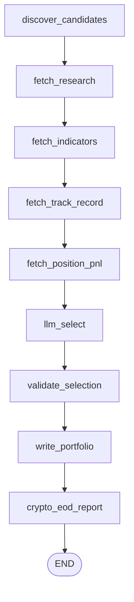
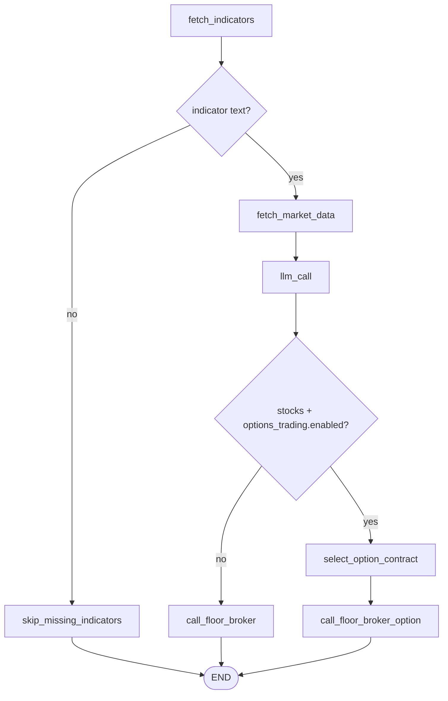

# Architecture

`multi-agent-ai-trader` is a three-agent trading floor — **Analyst**, **Dealer**, **Floor
Broker** — that trades US equities, crypto, and (when `options_trading.enabled`) single-leg
options on Alpaca paper accounts, deployed as independent
Kubernetes workloads on the DGX Spark k3s cluster. It is a re-platforming of an earlier
single-process script (`gpt-trader.py`) onto three independently-scaled k8s workloads that
communicate via a shared ConfigMap and plain HTTP, rather than a monolithic loop.

```
              08:55 America/New_York daily (k8s CronJob)
     + optional 12:30pm America/New_York run (feature-gated, off by default)
                         ┌─────────────────────────┐
                         │         Analyst          │
                         │  screener → news → LLM   │
                         └────────────┬─────────────┘
                                      │ writes
                                      ▼
                         ┌─────────────────────────┐
                         │  "portfolio" ConfigMap    │  ◄── no MLflow/DB, just a
                         │  {symbol, budget,        │      k8s API object
                         │   indicators, rationale} │
                         └────────────┬─────────────┘
                                      │ reads every poll
                                      ▼
                         ┌─────────────────────────┐
        every 600s  ───► │          Dealer          │  (long-running Deployment)
        while market     │ indicators + bars → LLM  │
        is open          │ (+ MCP option pick when  │
                         │  options_trading on)     │
                         └────────────┬─────────────┘
                                      │ HTTP POST /execute or
                                      │ /execute-option (if action != HOLD)
                                      ▼
                         ┌─────────────────────────┐
                         │       Floor Broker        │  (Deployment + Service)
                         │  Alpaca order placement   │
                         └────────────┬─────────────┘
                                      │
                                      ▼
                        Alpaca paper accounts (1: stocks/crypto, 2: options)
```

Analyst and Floor Broker never talk to each other directly. There is no message queue and
no shared filesystem — the only *coordination* state between agents is the `portfolio`
ConfigMap, and the only network hop is Dealer → Floor Broker. Separately, all three agents
also write fire-and-forget history rows to Postgres (see [Persistence](#persistence) below)
— that's an append-only audit trail read back by `/analyst-explain` and, since
`fetch_track_record`, by the Analyst itself, not a coordination channel any agent depends on
to function.

Independently of that cycle, a fourth CronJob queries Alpaca directly once a day after market
close and posts a summary to Slack — it has no dependency on the ConfigMap or on Dealer/Floor
Broker's HTTP hop:

```
               13:30-16:30 America/New_York :30 checks (k8s CronJob)
                         ┌─────────────────────────┐
                         │       EOD Report        │
                         │ close+30 → Slack recap  │
                         └─────────────────────────┘
```

## Repo layout

```
multi-agent-ai-trader/
├── config.yaml                  # single source of config for all agents + EOD report -- fetched
│                                  # live from GitHub at runtime (main branch), not baked into images
├── notebook.ipynb                # bare JupyterLab entry point (no pipeline logic — see below)
├── Dockerfile.analyst/.dealer/.floor-broker/.eod-report/.power-scheduler
├── k8s/                          # 4 CronJobs, 2 Deployments, 1 Service, RBAC, namespace, secrets doc
└── src/
    ├── common/                   # shared: Alpaca clients, config loader, logger, portfolio I/O, Slack
    ├── analyst/                  # CronJob — picks the tradeable universe, posts the morning report
    ├── dealer/                   # Deployment — decides BUY/HOLD/SELL per symbol
    ├── floor_broker/             # Deployment+Service — executes orders on Alpaca
    ├── eod_report/                # CronJob — posts a daily account/trade summary to Slack
    └── power_scheduler/          # CronJob — scales dealer/floor-broker to 0 outside trading hours
```

Each agent is its own Docker image and k8s workload — they scale, restart, and fail
independently. This is deliberate: Analyst runs once a day and can fail loudly without
affecting a mid-day trading loop; Dealer needs exactly one replica (`strategy: Recreate`)
to avoid two pods racing on the same portfolio; Floor Broker is a stateless request/response
service that can be replaced/restarted without losing any state (it holds none).

## Agent 1 — Analyst (`src/analyst/`)

**Workload:** `batch/v1 CronJob`, schedule `55 8 * * *` with `timeZone: America/New_York`
(08:55 ET, 35min before the 9:30 ET open; the run itself takes ~5min, dominated by the TAAPI
indicator-fetch throttle, so the Morning Report typically posts ~09:00 ET — ~30min before the
open), `concurrencyPolicy: Forbid` (no overlapping runs), `backoffLimit: 1` — a failed research
run is meant to surface immediately, not retry-storm. Entrypoint: `python -m src.analyst.main`.

A second, optional CronJob (`k8s/analyst-midday-cronjob-k3s.yaml`, `analyst-midday`) fires at
`30 12 * * *` `America/New_York` (12:30pm ET) using the same image and entrypoint, distinguished
only by an `ANALYST_RUN_LABEL: "midday"` env var. It exists to catch intraday movers/news the
08:55 run missed — Dealer already reacts to price moves on known symbols every poll, but can't
discover a symbol that wasn't in the morning's picks. It's feature-gated via
`analyst.midday_run.enabled` (`config.yaml`, default `false`): `main()` reads the env var, and if
it's a midday invocation with the flag off, logs and returns before `build_graph()` is even
called — no screener/news/TAAPI/LLM calls, no portfolio write, no Slack post. Toggling the flag
is a config-only `git push`, live within the same ~60s TTL as any other config change, no
redeploy needed (see `config.py` below). When enabled, `AnalystState["is_midday_run"]` is
threaded through the whole graph run: `write_portfolio` posts a "🕐 Midday Update" instead of
a duplicate "🌅 Morning Market Report" (same `slack.notify_morning_report`, overridden
`title`/`emoji`), and `crypto_eod_report` is skipped outright (it already ran this morning and
only ever covers the *prior* calendar day, so a second run has nothing new to report). One
side effect that's accepted, not fixed: `fetch_track_record`'s query has no upper date bound, so
a midday run's track-record context includes the same day's own earlier morning-run picks —
useful signal for the midday LLM pass, not a bug.

Runs every scheduled day regardless of whether the stock market is open — `main.py` checks
`src/common/market_calendar.py::is_stock_market_open()` (same Alpaca calendar API EOD Report
uses) once and threads the result into `AnalystState["stock_market_open"]`. On a closed day,
`discover_candidates` skips only the stock screener branch; crypto discovery is unconditional
(crypto trades 24/7), so Analyst still produces crypto picks. `write_portfolio` passes the flag
to `slack.notify_morning_report(...)`, which prepends a banner noting the stock market is
closed (and that crypto trading continues, when crypto is enabled) — unlike EOD Report, Analyst
never skips its entire run on a closed day.

**Purpose:** once a day, decide *which symbols are worth trading today* and hand that list
off to the Dealer.

**Implementation:** a 9-node LangGraph state machine (`src/analyst/graph.py`) over an
`AnalystState`:

| Node | What it does |
|---|---|
| `discover_candidates` | when `cfg.analyst.candidate_mix.enabled` (default true) **and** `cfg.trading.stocks.enabled` **and** `state["stock_market_open"]` (set once in `main.py`, see above), composes the stock+crypto candidate pool as a fixed percentage mix instead of letting the day's movers ranking alone decide it: `cfg.analyst.candidate_mix.pool_size` total candidates split across three buckets by `large_cap_pct`/`crypto_pct`/`screener_pct` (`_allocate_bucket_counts`, largest-remainder rounding so the counts always sum exactly to `pool_size`). The large-cap bucket is `sources.fetch_large_cap_candidates(cfg.analyst.large_cap_symbols)` (default 15 mega-caps incl. AAPL, MSFT, NVDA); the screener bucket is `sources.fetch_screener_candidates(...)` (today's `most-actives`/`movers`, same quality filters as before: `min_price_usd`, `max_abs_change_pct`, `min_dollar_volume_usd`, `excluded_symbol_suffixes`) with any symbol already in `large_cap_symbols` excluded to avoid double-counting; the crypto bucket is `sources.fetch_crypto_candidates(...)`. Each bucket is ranked by `abs(change_pct)` (`_by_abs_change_pct`) and trimmed to its target count, then `_fill_buckets_with_backfill` redistributes shortfall from a thin bucket (e.g. too few screener movers survive quality filters) to whichever other bucket(s) have spare supply beyond their own target, so the pool still hits `pool_size` when possible instead of silently coming up short. If `cfg.trading.crypto.enabled` is false, `crypto_pct`'s weight is silently redistributed to the other two buckets before allocation, and `fetch_crypto_candidates` is never called. The earnings-blackout filter (`sources.fetch_earnings_calendar()`, gated on `cfg.earnings_blackout.enabled`) runs on the large-cap and screener pools *before* bucket allocation, same risk control as before — a large-cap or screener symbol reporting earnings soon is dropped from consideration entirely, not just deprioritized. `fetch_large_cap_candidates` fails open on a per-symbol price-lookup error (keeps the symbol, omits `price`), unlike the screener's fail-closed behavior for the same lookup, since these are hand-picked names rather than unvetted movers. All stock-bucket candidates are tagged `market: "stocks"`; crypto candidates are tagged `market: cfg.trading.crypto_taapi_exchange`. When `candidate_mix.enabled` is false (or the market-open/stocks.enabled gates aren't met), `discover_candidates` falls back byte-for-byte to the legacy behavior: `fetch_screener_candidates` for stocks (still earnings-blackout filtered) plus, when `cfg.trading.crypto.enabled`, `fetch_crypto_candidates` — a fixed watchlist (`BTC/USD`, `ETH/USD`, `SOL/USD`; Alpaca's crypto screener has no most-actives equivalent) merged with `/v1beta1/screener/crypto/movers`. Crypto discovery in the legacy path is **not** gated on the stock-market-open flag, the stock quality filters, or the earnings blackout — it always runs when enabled |
| `fetch_research` | gated on `cfg.analyst.news.enabled` (short-circuits before any network call when false) — `sources.fetch_news(news_days=2)` (Alpaca News API, HTML stripped via BeautifulSoup) + `sources.fetch_yahoo_rss_headlines(...)` (Yahoo Finance RSS), concatenated into plain text |
| `fetch_indicators` | gated on `cfg.analyst.indicators.enabled` (short-circuits before any TAAPI call when false) — ranks `raw_candidates` by `abs(change_pct)` (missing values sort last) and calls `src.common.indicators.fetch_indicators_bulk` (shared with the Dealer) for the top `cfg.analyst.indicator_fetch_limit` (default 15) — one TAAPI `/bulk` POST per symbol covering `rsi, macd, vwap, bbands, sma, ema`, sleeping `cfg.taapi.min_request_interval_secs` between calls to respect TAAPI's free-tier 1-req/15s cap. At the default limit this adds ~3.5 minutes to the once-daily run — accepted as a fixed cost of a pre-market CronJob, unlike the Dealer's 10-minute poll cycle where the same rate limit is a tighter constraint. Not every candidate gets indicator data; only the top movers by size do — **except** `analyst.large_cap_symbols`, which are appended to the fetch list even when they fall outside the ranked cutoff, so a quiet blue-chip day still gets real RSI/MACD/etc. numbers behind it rather than being silently steered away from by the system prompt's own preference for indicator-backed reasoning |
| `fetch_track_record` | gated on `cfg.analyst.track_record.enabled` (short-circuits before any DB call when false) — reads the Analyst's own pick history plus matching Dealer decisions and Floor Broker events from Postgres via `db.fetch_analyst_picks_since()`/`fetch_dealer_decisions_since()`/`fetch_floor_broker_events_since()` for the last `cfg.analyst.track_record_days` (default 5) calendar days, formatted as plain text (qualitative sequence only — no computed P&L; see [Persistence](#persistence)). Runs before `write_portfolio` records this run's own picks, so a symbol picked *this* run never appears in its own track record |
| `fetch_position_pnl` | gated on `cfg.analyst.position_pnl.enabled` (short-circuits before any Alpaca call when false) — `trading_client.get_all_positions()` + `summarize_positions()` (`src/common/eod.py`, same shape `crypto_eod_report` already uses, no `only_crypto` filter so both stocks and crypto are included) formatted as plain text: symbol, qty, avg entry price, current price, unrealized $ and %. A live point-in-time snapshot only — not persisted, not compared across days, and not per-pick attribution (a symbol can be bought/sold more than once); complements `fetch_track_record`'s qualitative history rather than replacing it. Fails open (empty text) on any Alpaca API error, matching `fetch_research`/`fetch_indicators` |
| `llm_select` | the actual LLM call — see below |
| `validate_selection` | overrides each pick's `exchange` field with the `market` tag `discover_candidates` actually assigned that symbol (never trusts the LLM's own copy of `exchange`), drops any pick whose symbol isn't in `raw_candidates` at all (a hallucination), then walks the remaining picks in the LLM's own returned order and greedily drops (logs, doesn't error) any pick that would push the running total of `budget` over `cfg.analyst.max_total_budget_usd` — a last-line-of-defense cap since no per-pick `budget` upper bound exists on its own (`src/analyst/schema.py`) and the LLM's suggested `default_budget` is only a prompt hint it can ignore |
| `write_portfolio` | patches the `portfolio` ConfigMap via the `kubernetes` Python client |
| `crypto_eod_report` | gated on `cfg.trading.crypto.enabled` — posts a crypto-only "Crypto EOD Report" to Slack covering the prior full ET day's crypto fills/positions; see below |



**LLM call:**
```python
llm = ChatOpenAI(
    base_url=cfg.llm.base_url,   # OpenAI-compatible endpoint — see platform-services.md
    api_key="not-needed",
    model=cfg.llm.model,
    temperature=cfg.llm.temperature,
    timeout=_llm_timeout(cfg),   # cfg.llm.request_timeout_s (default 120) — per-request wall-clock ceiling
    max_retries=0,               # a hung generation must fail fast, not retry into the same slow Ollama host
).with_structured_output(PortfolioSelection)
```
The `timeout` / `max_retries=0` pair mirrors the Dealer's `llm_call` (see the GB10 silent-hang
incident): the Analyst CronJob shares the DGX Ollama host, so a hung structured-output call must
fail on a wall-clock ceiling rather than pin the pod and an Ollama slot indefinitely.
The system prompt instructs the model to pick at most `max_universe_size` (10) symbols from
the candidates/research, each with a `budget` (default `default_budget`=5000), an
`indicators` list (default `[rsi, macd, vwap, bbands, sma, ema]`), and a rationale. Output is
enforced as structured JSON via `PortfolioSelection` (pydantic, `src/analyst/schema.py`) —
there is no manual JSON-parsing/regex step; LangChain's `.with_structured_output()` handles
that entirely. Each candidate the LLM sees carries a `market` field ("stocks", or a crypto
exchange name); the prompt tells it to copy that value into the pick's `exchange` field, but
`validate_selection` re-derives `exchange` from the known `market` tag regardless — the LLM's
own copy is never trusted as-is.

**Output — the `portfolio` ConfigMap** (namespace `multi-agent-ai-trader`):
```json
{
  "generated_at": "2026-08-01T12:55:03Z",
  "symbols": [
    {"symbol": "NVDA", "exchange": "stocks", "budget": 5000, "indicators": ["rsi","macd","vwap","bbands","sma","ema"], "rationale": "..."}
  ]
}
```
This is the **only** interface between Analyst and the rest of the system. No RAG, no
vector search, no MLflow logging of the selection — the "research" step is plain text
concatenation fed straight into the prompt.

Immediately after writing the ConfigMap — still inside the same CronJob pod, before market
open — `write_portfolio` also fetches the account balance (`trading_client.get_account()`) and
posts a "Morning Market Report" to Slack (`slack.notify_morning_report`): the day's picks with
budgets/rationale, plus current equity/cash/buying power. This is a by-product of the same run,
not a separate schedule — there is no dedicated Slack CronJob for it, unlike the EOD Report below.

Right after that, a `crypto_eod_report` graph node (gated on `cfg.trading.crypto.enabled`) posts a
second, crypto-only "Crypto EOD Report" to Slack covering the **prior full ET calendar day's**
crypto fills/positions (`slack.notify_crypto_eod_report`). Crypto trades 24/7, so it has no market
close to hang a report off of the way stocks do — rather than a separate always-on schedule, it
piggybacks on the Analyst's existing daily 08:55 America/New_York run, right after the new
day's picks go out (`write_portfolio` runs before `crypto_eod_report` in the graph). Uses
the same `src.common.eod.fetch_fills`/`summarize_positions` helpers as the stock EOD Report below,
filtered to crypto (`"/" in symbol`, the same convention `alpaca_client.get_current_ask_price`
already uses to distinguish crypto tickers).

## Agent 2 — Dealer (`src/dealer/`)

**Workload:** `apps/v1 Deployment`, `replicas: 1`, `strategy: {type: Recreate}` — explicitly
to prevent two Dealer pods racing to read/act on the same portfolio during a rolling update.
No ports exposed (it's a loop, not a server). Entrypoint: `python -m src.dealer.main`.

**Purpose:** continuously, while the market is open, decide BUY/HOLD/SELL for every symbol
in the current portfolio and hand non-HOLD decisions to Floor Broker.

**Main loop** (`src/dealer/main.py`):
```
while True:
    if market_is_open(cfg):              # Alpaca clock + 15-min post-open buffer
        portfolio = read_portfolio()      # fresh read of the ConfigMap every cycle, no caching
        for symbol in portfolio.symbols:
            try:
                graph.invoke(DealerState(...), config={"tags": ["dealer"]})
            except Exception:
                log_and_continue()        # one bad symbol never kills the loop/pod
    sleep(cfg.trading.pollsecs)           # 600s (10 min)
```
`market_is_open` checks `trading_client.get_clock().is_open` via Alpaca, plus a
`cfg.trading.buffer` (15 min) wait after the 9:30 ET open bell "to avoid volatility"; a
`cfg.trading.market_override` config flag can force-treat the market as open for testing.

On the open→closed transition, it also posts `slack.notify_stock_market_closed(next_open)` —
edge-detected via a module-level `_last_market_open` flag so it fires once per transition, not on
every 600s poll while the market stays closed for hours. This is distinct from EOD Report's
`notify_market_closed` (a once-daily "today wasn't a trading day" notice) — this one is Dealer's
own live status signal, so a genuinely closed market and a stuck/crashed Dealer pod are
distinguishable from Slack alone.

**Graph** (`src/dealer/graph.py`), a 7-node state machine over `DealerState`:

| Node | What it does |
|---|---|
| `fetch_indicators` | fetches every indicator configured for the symbol (or all of `cfg.indicators` if the entry says `["ALL"]`) from **TAAPI.io** — a third-party technical-analysis API, unrelated to any Miramar platform service — in a single `/bulk` POST request (`indicators.py`), and builds a natural-language indicator text block |
| `skip_missing_indicators` | terminal fallback when `fetch_indicators` comes back empty (TAAPI 200 with no data — typically too few historical bars for a thinly-traded pair): records a `HOLD` decision and skips the cycle rather than sending an empty indicator block to the LLM (which otherwise improvises a "please provide indicators" HOLD) |
| `fetch_market_data` | gated by `ohlcv_enrichment.enabled` — for stock entries only (`exchange == "stocks"`), fetches Alpaca OHLCV bars at the configured timeframes (`5m`, `1h`, `1d` by default) via `src.common.bars.fetch_multi_timeframe_bars`, computes derived market-structure features (`src.dealer.features`), and formats a compact prompt block. Crypto entries skip this node cleanly and keep the indicator-only path |
| `llm_call` | the decision LLM call — see below. It receives TAAPI indicators first, optional OHLCV-derived context second, and, when `strategy.dealer_memory.enabled` is true, recent same-symbol Dealer decisions and Floor Broker events from Postgres as the final prompt context |
| `select_option_contract` | **only reached when `options_trading.enabled` and `exchange == "stocks"`** — an MCP-backed tool-calling agent that turns the underlying signal into one option contract. See [Options trading](#options-trading--mcp-backed-contract-selection) below |
| `call_floor_broker` | HTTP `POST /execute` to Floor Broker if action != HOLD; a BUY is additionally refused locally (never forwarded) by macro blackout, same-symbol stop cooldown, win-rate throttle, confidence, or authorized-budget gates — see [Risk controls](#risk-controls-and-failure-handling). Reached for crypto always, and for stocks only when options trading is off |
| `call_floor_broker_option` | HTTP `POST /execute-option` to Floor Broker with the selected contract. Applies the same macro-blackout / symbol-stop-cooldown / win-rate-throttle / budget gates as `call_floor_broker`, plus a re-validation of the LLM's pick against the config DTE and delta windows, then sizes the order (`risk_per_trade_usd // (premium * 100)` contracts) |



**LLM call:** same pattern as Analyst — `ChatOpenAI(base_url=cfg.llm.base_url, ...).with_structured_output(Signal)`.
System prompt: *"You are an expert technical trader in stocks. Based on the values of ALL
of the indicators below, decide if you should BUY, SELL, or HOLD. size_hint must be a decimal
fraction between 0.0 and 1.0 representing the portion of the symbol's budget to deploy on a BUY
(e.g. 0.5 = half the budget, 1.0 = the full budget) — never a dollar amount or share count."*
The `Signal` model
(`src/dealer/schema.py`) is `{symbol, action: BUY|HOLD|SELL, reasoning, size_hint}` —
`size_hint` (a 0–1 fraction, default 1.0) scales the symbol's configured `budget` on a BUY
(`budget * size_hint`); it has no effect on SELL, which ignores `budget` entirely
(`execution.py::sell()` closes the full open position, not a partial amount). Two cases are
refused locally rather than forwarded to Floor Broker: a BUY signal on a held-only entry
(`budget == 0`, see `merge_held_positions()` above — `status="skipped",
reason="no_authorized_budget"`), and a BUY whose `size_hint` scales the budget to exactly $0
(`status="skipped", reason="size_hint_zero"` — `ExecuteRequest.budget` requires `> 0`, so this
would otherwise fail request validation rather than get a graceful business-logic skip). A
budget scaled to a small but nonzero amount is still forwarded as-is — Floor Broker's own
minimum-notional/insufficient-qty checks (`execution.py`) already handle that gracefully with
their own reason codes, so Dealer doesn't need a second floor.

When `strategy.dealer_memory.enabled` is true, a same-symbol memory block is added to the user
prompt. It is intentionally advisory: the LLM sees recent `BUY`/`HOLD`/`SELL` reasoning plus
recent fills/skips/stops for the same symbol, but deterministic skip logic still owns hard
safety rules such as stop-loss cooldown.

When `ohlcv_enrichment.enabled` is true, stock symbols also get a separate "Additional OHLCV
context" prompt block generated from Alpaca bars. This is context only: it does not change the
`Signal` schema and it cannot gate, veto, or resize trades. The audit row records whether usable
OHLCV context was actually present via `dealer_decisions.ohlcv_enrichment_active`, plus a
per-symbol-cycle `cycle_id` for later ablation queries.

**Dispatch to Floor Broker** — plain in-cluster HTTP, no message queue:
```python
requests.post(f"{cfg.floor_broker.base_url}/execute", json={
    "symbol": ..., "exchange": ..., "action": ...,
    "budget": ..., "slP": cfg.trading.slP, "tpP": cfg.trading.tpP,
}, timeout=30)
```
`cfg.floor_broker.base_url` = `http://floor-broker.multi-agent-ai-trader.svc.cluster.local:8000`
— standard k8s Service DNS, not a Miramar platform endpoint. HOLD signals never leave the
Dealer pod (`execution_result = {"status": "skipped", "detail": "HOLD"}` is set locally).

On a successful response, `call_floor_broker` forwards Floor Broker's `reason`, `fill_price`,
`sl_price`, `tp_price` fields (see Floor Broker's `ExecuteResponse` below) straight through as
keyword arguments to `slack.notify_floor_broker_result`, so the Slack notice for a BUY/SELL shows
the actual fill price and TP/SL levels, not just the request Dealer sent. The error-response and
request-exception branches are unchanged — they call `notify_floor_broker_result` with only the
original 4 positional arguments, so those optional fields simply render as absent.

### Options trading — MCP-backed contract selection

Gated by `options_trading.enabled` (`config.yaml`, currently **on**). When enabled, the Dealer's
graph routes **every stock signal** — not crypto — through `select_option_contract` →
`call_floor_broker_option` instead of `call_floor_broker`; the plain equity bracket-order path is
only used for stocks when this flag is off. The Dealer's own `Signal` LLM call is unchanged: it
still decides BUY/SELL/HOLD on the *underlying*, and that direction maps to
`right = "call" if action == "BUY" else "put"` (a bearish SELL becomes a long put, never a short
position). `HOLD`, or confidence below `strategy.min_confidence`, produces no contract.

**Contract selector** (`_select_option_contract_async`, `src/dealer/graph.py`) — a LangChain
tool-calling loop (≤ `_MAX_TOOL_CALL_ROUNDS` = 6 rounds) using the same `cfg.llm` model as the
Dealer, bound to Alpaca's options tools via MCP:

- `src/dealer/mcp_options.py` launches the `alpaca-mcp-server` package (`langchain-mcp-adapters`)
  with `ALPACA_TOOLSETS=assets,options-data,account` — **read-only**; the Dealer never places
  orders over MCP. It resolves the same live-account credentials as everything else
  (`alpaca_client.live_account_env_names()`, i.e. `config.yaml`'s `alpaca.live` pair).
- The LLM is given the underlying, desired `right`, and the config windows
  (`dte_min`/`dte_max`, `target_delta_min`/`target_delta_max`, `min_open_interest`, `min_volume`),
  calls the MCP tools to pull the option chain, quotes, and Greeks, then returns a structured
  `OptionContractPick` (`src/dealer/schema.py`): `contract_symbol`, `strike`, `expiration`,
  `right`, `delta`, mid-price `premium`, and a per-contract `reasoning`. Any exception →
  `option_pick = None` → the entry is skipped cleanly.
- The loop is **token-bounded** so a chatty tool result can't grow the prompt without limit
  (this caused a silent DGX hard-hang on 2026-08-27 — see `docs/models.md`): raw chain JSON is
  compacted to ≤40 delta-ranked rows before entering history (`src/dealer/option_chain.py`), the
  loop stops requesting tools past ~12k estimated tokens, old tool-message bodies are neutralized
  before any call that would exceed a 24k hard cap, and each Ollama call has a
  `llm.request_timeout_s` ceiling with no retries. If structured output still fails,
  `_fallback_pick` deterministically picks from the rows already seen (delta + DTE + quote gates,
  plus `min_open_interest` / `min_volume` for rows where Alpaca actually returned those fields)
  instead of returning nothing. A hallucinated or failing tool call inside the loop is logged and
  skipped rather than aborting the whole selector.
- The structured `OptionContractPick` is **validated before use** (`_structured_pick_rejection`):
  its `right` must match the intended direction (BUY → call, SELL → put) and its `contract_symbol`
  must be one actually seen in a chain response. A schema-valid but wrong-direction or hallucinated
  pick is rejected and `_fallback_pick` runs instead — the fallback is direction-safe and only
  chooses from observed rows.
- A pick that passes that check is then **reconciled** (`_reconcile_structured_pick`): its `strike`,
  `expiration`, `right`, `delta`, and `premium` are overwritten with the values observed for that
  contract in the chain (OCC symbol for strike/expiration/right, the row's Greeks for `delta`, the
  quote mid for `premium`) — the same data `_fallback_pick` trusts. Only the model's `reasoning`
  survives. This stops a schema-valid pick that names a real, seen contract but attaches a
  fabricated low `premium` (→ oversized `qty` in `call_floor_broker_option`) or an in-window
  `delta` from driving execution on model-supplied numbers, and it catches a call-labelled pick
  whose seen OCC symbol is actually a put (which `_structured_pick_rejection`, comparing only the
  model's self-reported `right`, would allow). If the matched row has no usable direction, delta,
  or quote, reconciliation returns nothing and `_fallback_pick` runs.

**`call_floor_broker_option`** re-validates the pick server-side before executing — it does not
trust the LLM's copy of the constraints:

- All the same entry gates as `call_floor_broker` apply, and unconditionally (unlike the stock
  path where they only guard `action == "BUY"`): macro blackout, same-symbol stop cooldown,
  win-rate throttle, `budget > 0`. Every option entry — call *or* put — is a brand-new position;
  there is no "SELL means close" case here.
- DTE (recomputed in US/Eastern) must fall in `[dte_min, dte_max]`; `abs(delta)` must fall in
  `[target_delta_min, target_delta_max]`; `strategy.risk_per_trade_usd` must be set. Otherwise
  `status="skipped"` with `reason` `dte_out_of_range` / `delta_out_of_range` /
  `risk_per_trade_usd_not_configured`.
- Sizing: `qty = int(risk_per_trade_usd // (premium * 100))`; `qty < 1` →
  `status="skipped", reason="qty_zero"`.
- Duplicate guard: after sizing, a best-effort `GET /option-exposure` on the Floor Broker returns
  every contract already held or with a BUY order in flight. If the pick is one of them the Dealer
  skips (`status="skipped", reason="duplicate_option_position"`) rather than spending a Slack line
  and an `/execute-option` round trip — `_fallback_pick` is deterministic, so a slow-filling BUY
  would otherwise be re-picked identically every cycle. A failed/non-200 exposure check just
  proceeds; `buy_option()` enforces the same rule authoritatively.
- On success it POSTs `POST /execute-option` to Floor Broker (payload includes `contract_symbol`,
  `qty`, `right`, `strike`, `expiration`, `delta`, `premium`, `reasoning`, `cycle_id`).

The Dealer decision itself is still recorded via `db.record_dealer_decision` and
`slack.notify_dealer_signal` on the underlying symbol (commit `3e521a4`); the Floor Broker
outcome is recorded as an `option_<status>` `floor_broker_events` row.

## Agent 3 — Floor Broker (`src/floor_broker/`)

**Workload:** `apps/v1 Deployment` + `ClusterIP Service` on port 8000. Uses the shared
`multi-agent-ai-trader-configmap-reader` ServiceAccount (ROADMAP P0.5) to read the
`buy-kill-switch` ConfigMap — it still never reads/writes the portfolio ConfigMap Analyst/Dealer
use. Entrypoint: `uvicorn.run("src.floor_broker.app:app", host="0.0.0.0", port=8000)`.

**Purpose:** the only component that actually talks to Alpaca's *trading* API (Analyst and
Dealer only use Alpaca's *data*/*screener*/*news* endpoints). Purely mechanical — it never
calls an LLM.

**API** (`src/floor_broker/app.py`):
| Route | Purpose |
|---|---|
| `GET /healthz` | `{"status": "ok"}` — backs the Deployment's readiness/liveness probes |
| `POST /execute` | body: `{symbol, exchange, action: BUY\|SELL, budget, slP, tpP}` → dispatches to `execution.buy()`/`execution.sell()` |
| `POST /execute-option` | body: `{contract_symbol, qty, premium, right, strike, expiration, delta, reasoning, symbol, cycle_id}` → `execution.buy_option()`. Only called when `options_trading.enabled`; see [Options trading](#options-trading--mcp-backed-contract-selection). `buy_option()` refuses a second BUY for a contract already held or with a BUY in flight (`_duplicate_option_buy_skip` — options have no top-up concept, and a doubled BUY corrupts the OCC-keyed `_option_positions` tracking) |
| `GET /option-exposure` | `{contracts: [...]}` — every option contract this process holds or has a BUY order in flight for (`_option_positions` ∪ pending BUYs). The Dealer checks this before a new option entry to skip a duplicate early |
| `POST /flatten-crypto` | force-sells every open crypto position; called by Power Scheduler before it scales this pod to 0 (`power_schedule.flatten_crypto_before_powerdown`, default true) |
| `POST /flatten-options` | force-sells every open option position; called by Power Scheduler before scale-to-0 when `power_schedule.flatten_options_before_powerdown` (default **false** — options are already DTE-force-closed well before expiry, so an overnight hold is acceptable) |

Alpaca `APIError`s are caught and returned as `{"status": "error", "detail": ...}` (HTTP 200)
rather than raised; unexpected exceptions become a 500.

`ExecuteResponse` also carries optional `reason`, `order_id`, `fill_price`, `sl_price`, `tp_price`
fields (all `None` unless `execution.buy()`/`sell()` populate them — see below), so Dealer can
forward a stable reason code (and, for stock BUYs, the pre-computed bracket prices) to Slack
instead of only the request it sent. `reason` is one of `opening_position` (a BUY), `dealer_signal`
(an explicit SELL from the Dealer's LLM decision), `take_profit`/`stop_loss` (an asynchronous
bracket-leg fill for stocks, or a synthetic crypto stop/target trigger — see below — both detected
by the pollers below), or a skipped-BUY reason (`buy_kill_switch_active`, `state_not_reconciled`,
`budget_below_minimum`, `daily_profit_target_reached`, `daily_loss_limit_reached`,
`open_orders_exist`, `market_value_unavailable`, `budget_exhausted` — see the daily halt section
and `buy()` below). As of ROADMAP P0.14, `/execute` itself never
returns `fill_price` — BUY/SELL orders are submitted and the response comes back immediately with
`status="submitted"`; the actual fill (`opening_position`/`dealer_signal`) and bracket-leg fills
(`take_profit`/`stop_loss`) are both reported later, asynchronously, only via the Slack posts the
pollers below send directly.

**Order logic** (`src/floor_broker/execution.py`):
- **`buy()`** — safety gate first: `budget` is treated as the dollar amount **authorized** for
  the symbol, not a one-shot "open a fresh position" ticket. If an open order already exists for
  the symbol (an in-flight BUY not yet filled, or a pending SELL), the buy is still
  unconditionally skipped (`reason="open_orders_exist"`) — layering a new BUY on an in-flight
  order is racy regardless of budget math. If an open **position** already exists instead, `buy()`
  tops it up rather than skipping: it reads the position's `market_value` and, if
  `budget - market_value > 0`, submits a smaller BUY for just the remainder — repeated BUY
  decisions across Dealer poll cycles converge the position toward `budget` over time, with no
  extra state needed (each call recomputes headroom off the live position). If `market_value` is
  unavailable, the BUY is skipped (`reason="market_value_unavailable"`) rather than guessed — this
  is a trading-money gate, so it fails **closed** on missing data, unlike the Analyst's
  informational P&L snapshot which fails open. If the existing position's value already meets or
  exceeds `budget`, the BUY is skipped (`reason="budget_exhausted"`). A reduced "remaining budget"
  flows unchanged into the same sizing logic below, so a remainder too small for one share
  (stocks) or below Alpaca's crypto minimum both fall through to the existing
  `insufficient_qty`/`budget_below_minimum` skips automatically. For stocks, submits a
  **bracket order** (`OrderClass.BRACKET`) with computed stop-loss (`ask_price * slP`) and
  take-profit (`ask_price * tpP`) legs, `TimeInForce.DAY` — priced off the ask since that's
  where a BUY actually fills, not the bid/ask mid. If `strategy.max_bid_ask_spread_pct` is set,
  `buy()` first fetches the current bid and ask, skips invalid quotes or spreads wider than the
  configured cap (`reason="wide_bid_ask_spread"` / `"invalid_bid_ask_quote"`), and reuses that
  accepted ask for quantity and bracket pricing. TP/SL prices are rounded to 4 decimals for
  stocks under $1.00 and 2 decimals otherwise (`_round_to_tick`) — sub-$1 stocks are quoted in
  $0.0001 increments (SEC Rule 612), so 2dp rounding can land TP/SL on the same cent as
  `base_price` and get rejected. For crypto (`exchange != "stocks"`), submits a plain
  notional market buy instead (`TimeInForce.GTC`) — bracket orders aren't used for crypto.
  The notional amount is rounded to 2 decimals before submitting — Alpaca rejects a crypto
  notional with finer precision than that (`code 42210000`). If the rounded notional is below
  `MIN_CRYPTO_NOTIONAL` ($10) — Alpaca also rejects a crypto notional under its minimum order
  value (`code 40310000`, "cost basis must be >= minimal amount of order 10") — the BUY is
  **skipped** (`status="skipped", reason="budget_below_minimum"`), not clamped up: silently
  raising the notional to the minimum could submit an order larger than the caller's intended
  budget.
- **`sell()`** — sells the full open quantity at market. Has an explicit **retry-after-cleanup**
  path: if Alpaca rejects with error code `40310000` (conflicting orders blocking the sell),
  it cancels the blocking orders (ignoring 404s), *re-fetches* the now-current open quantity
  (it can change once blockers clear), and resubmits.
- **`buy_option()`** — the options entry path, on `trading_client` (the one live account, same as
  stocks/crypto). Runs the same buy-preflight and `max_concurrent_positions` skips as `buy()` —
  option BUYs share the live account's daily-P&L halt and open-position cap, no options carve-out.
  Between those two it runs `_duplicate_option_buy_skip`: options have no top-up concept (every
  Dealer `option_pick` is a brand-new entry and `_fallback_pick` is deterministic, so a
  slow-filling BUY gets re-picked identically next cycle), and `_option_positions` is keyed by OCC
  symbol and overwritten wholesale on each fill, so a doubled BUY both over-positions the account
  and corrupts the tracked qty/entry premium that synthetic SL/TP/DTE protection sizes off. A BUY
  already in `_pending_option_fills` for the contract → `reason="option_buy_in_flight"`; the
  contract already in `_option_positions` or open at Alpaca (`_fetch_open_position`) →
  `reason="already_holding_contract"`. The reconcile scan (gated by `is_state_reconciled()`, which
  the buy-preflight enforces) seeds `_pending_option_fills` from every open Alpaca option order, so
  the in-memory view is authoritative. It then **re-quotes the contract's
  live ask** (`get_current_option_ask_price`) and rejects it if `qty * live_ask * 100` exceeds
  `options_trading.max_notional_usd` (`reason="notional_cap_exceeded"`) — the cap is enforced
  against the market, not the LLM's claimed premium. A plain `MarketOrderRequest`
  (`TimeInForce.DAY`) is submitted; the order id is registered in `_pending_option_fills` and the
  function returns `status="submitted"` immediately. `_option_positions` and the `options_trades`
  DB row are written **only on a confirmed fill**, by `check_pending_option_fills()` (below).
  `app.py`'s `ExecuteOptionRequest` also enforces an outer non-configurable `MAX_OPTION_NOTIONAL`
  ($100k) sanity ceiling on the raw request.
- **`sell_option()`** — closes an option position on the same live account. Submit-only, like `sell()`: it
  does not clear `_option_positions` or close the DB row synchronously — `check_pending_option_fills()`
  does that once the SELL's own fill (or terminal non-fill) is observed. Also cancels a still-unfilled
  BUY order for the same contract before selling. Called by `check_option_stops()` (synthetic
  SL/TP/DTE-force-close) and `flatten_all_options()`.

**Asynchronous order submission (ROADMAP P0.14).** Both `buy()` and `sell()` submit the order to
Alpaca and return immediately with `status="submitted"` — they no longer block waiting to learn
whether the order filled. `buy()` registers `order_id` in a module-level, in-memory dict,
`_pending_fills: dict[order_id, context]` (symbol, action, reason, and — for stock BUYs — the
pre-computed `sl_price`/`tp_price`); `sell()` does the same, minus the SL/TP prices. The
`poll_pending_fills()` daemon thread (below) later resolves each entry to a fill (or drops it on
a terminal non-fill status) and posts the actual fill price to Slack once known.

**Async TP/SL fill detection.** A stock BUY's stop-loss/take-profit legs are a bracket
(`OrderClass.BRACKET`, OCO) — whichever leg fills first, Alpaca auto-cancels the other, and
neither fill is visible through the original `/execute` request/response cycle since it can
happen minutes or hours later. To surface these as Slack notices, `buy()` registers the parent
bracket order id in a second module-level, in-memory dict, `_tracked_brackets: dict[symbol,
order_id]` (stocks only — crypto has no bracket legs), and `sell()` removes the symbol from it
immediately before submitting an explicit sell (so a manual/Dealer-driven SELL doesn't also get
reported as a TP/SL fill once the bracket's legs are cancelled as a side effect).

`src/floor_broker/main.py` starts seven daemon background threads alongside uvicorn's HTTP server
in the same process — `poll_reconciliation()` (restart recovery, see below), `poll_kill_switch()`
(see the kill switch section below), `poll_eod_flatten()` (day-trading-mode flatten, see
`eod_flatten` config), and `poll_symbol_bases()` (refreshes the known-USD-crypto-base set from
Alpaca) are four of them; the three fill-watchers are:
- **`poll_pending_fills()`** — every `PENDING_FILL_POLL_INTERVAL_S` (30s) calls
  `execution.check_pending_fills()`, which re-fetches each tracked order by id and, once
  `filled_avg_price` is populated, returns a `kind="fill"` event (dropping the entry once it
  does). If the order instead reaches a terminal non-fill status (`CANCELED`/`REJECTED`/
  `EXPIRED`), it returns a `kind="terminal"` event instead, also dropping the entry — this is the
  only place that outcome is ever observed, so it must be reported, not silently dropped.
  `main.py` posts a fill event to Slack via `slack.notify_floor_broker_result(..., status=
  "executed", reason=event["reason"], fill_price=event["fill_price"])`, and a terminal event via
  `status="no_fill"`.
- **`poll_bracket_fills()`** — every `BRACKET_FILL_POLL_INTERVAL_S` (30s) calls
  `execution.check_bracket_fills()`, which re-fetches each tracked bracket order
  (`get_order_by_id(..., filter=GetOrderByIdRequest(nested=True))` for the `legs`), classifies a
  terminal leg by `OrderType` (`LIMIT` → `take_profit`, `STOP` → `stop_loss`) and `OrderStatus`
  (`FILLED` vs. `CANCELED`/`EXPIRED`/`REJECTED`), untracks the symbol once either leg reaches a
  terminal state, and returns a `kind="fill"` event per resolved fill or a `kind="terminal"` event
  if both legs closed with no fill. `main.py` posts each event to Slack the same way (`"executed"`
  vs. `"no_fill"`). The same loop also drains `execution.check_crypto_stops()` and
  `execution.check_option_stops()` (below) — no separate thread for either.
- **`poll_pending_option_fills()`** — every 30s calls `execution.check_pending_option_fills()`,
  the option-contract equivalent of `poll_pending_fills()` (separate because options are tracked
  by OCC symbol with a synthetic exit mechanism, not by asset account). This is the **only**
  place `_option_positions` and the `options_trades` row are written for a BUY, and the only place
  they are cleared for a SELL — both keyed to a confirmed fill, with partial-fill and
  restart-recovery handling (Tasks 27/28). A zero-fill terminal order writes no position and no DB
  row.

**Transient-vs-terminal error handling.** A poll's `get_order_by_id()` call can itself fail —
rate limit, timeout, an Alpaca-side 5xx. `execution._is_order_not_found()` only treats this as
"nothing left to watch" for a *confirmed* 404 (Alpaca's code `40410000`, exposed as
`ORDER_NOT_FOUND_CODE`); any other error, including one whose body doesn't even parse as JSON, is
treated as transient — the entry stays tracked, and a `poll_failures` counter on it (visible on
`_pending_fills[order_id]["poll_failures"]` or `_tracked_brackets[symbol]["poll_failures"]` once
non-zero) is incremented and logged, then cleared again once the order is reachable. This means a
brief Alpaca outage no longer silently stops watching a still-live order.

Both loops also catch and log any exception per iteration at the top level, so one bad poll (e.g.
an exception outside `check_pending_fills()`/`check_bracket_fills()`'s own error handling) never
kills either thread.

**Restart recovery.** `_tracked_brackets` and `_pending_fills` are both in-memory and
single-process, so a Floor Broker restart would otherwise lose track of every order/bracket that
was still open at the moment it went down. `execution.reconstruct_tracked_state()` runs once at
the top of `main()`, before either poll thread starts, and calls
`trading_client.get_orders(GetOrdersRequest(status="open", nested=True))` — this queries at the
order-*family* level (Alpaca's own semantics: a bracket whose entry already filled but whose
TP/SL legs are still live still counts as "open"), so it correctly re-populates both dicts:
orders with no legs go into `_pending_fills`, brackets with at least one still-open leg go into
`_tracked_brackets`. Only orders still open on Alpaca are restorable this way — by definition
nothing has filled yet, so no notification could have been missed by the restart itself.

`reconstruct_tracked_state()` retries the underlying `execution.reconcile_tracked_state_once()`
up to 5 times with exponential backoff (5s, 10s, 20s, 40s) rather than giving up on the first
`APIError` — a transient Alpaca outage at exactly boot time shouldn't permanently strand the pod
with empty tracking dicts. `execution.is_state_reconciled()` stays `False` until an attempt
succeeds, and `execution.buy()` refuses new BUYs (`status="skipped"`,
`reason="state_not_reconciled"` -- `ExecuteResponse`'s status `Literal` doesn't have a distinct
"rejected" value, so this reuses "skipped" like every other declined-BUY outcome) while it's
`False`, since submitting a fresh order before
Alpaca's live state has been reconciled risks losing track of it exactly like the gap this
mechanism exists to close (SELL is unaffected — same asymmetry as the kill switch below). If all
5 startup attempts fail, `main.poll_reconciliation()` keeps retrying `reconcile_tracked_state_once()`
in the background every 60s until it succeeds, un-blocking BUY execution without needing a pod
restart.

**Limitation:** the one remaining gap is a fill that happens *during* the restart/reconciliation
window itself — between the old pod dying and reconciliation succeeding on the new one. The
underlying order/TP/SL still executes correctly on Alpaca's side (Alpaca owns the order, not
Floor Broker) regardless, but the Slack notice for that specific fill is missed. Closing this
fully would require persisting fill history outside process memory (e.g. the durable event store
in ROADMAP P1.1) to reconcile against Alpaca's *closed* orders too, not just its open ones — out
of scope here. This is a narrow window (pod restart/reconciliation time), not the full
"no persistence at all" gap this section used to describe.

**Runtime BUY kill switch (ROADMAP P0.5).** `src/common/kill_switch.py::buy_kill_switch_active()`
reads the `buy-kill-switch` ConfigMap fresh (no caching) at the very top of `execution.buy()`,
before any position/order lookup. If active, the BUY is skipped
(`status="skipped", reason="buy_kill_switch_active"`) without ever calling Alpaca; `sell()` is
completely untouched, so SELL always remains available even with the switch on. A missing
ConfigMap (e.g. before the deploy workflow's seed step has ever run) fails open — treated as
inactive rather than blocking every BUY on a setup gap — but any other k8s API error propagates.
`src/floor_broker/main.py::poll_kill_switch()` is one of the seven daemon threads described above,
checking the switch every `KILL_SWITCH_POLL_INTERVAL_S` (30s) purely to post a
Slack notice (`slack.notify_buy_kill_switch`) on a state *transition* — `/execute` itself already
re-checks the switch fresh on every request, so this thread never gates trading, only reports on
it. The first poll after a pod start only discovers the switch's current state and never counts
as a transition.

Runbook — activate/deactivate without a redeploy:
```sh
# Block new BUY orders (SELL remains permitted):
kubectl patch configmap buy-kill-switch -n multi-agent-ai-trader --type merge -p '{"data":{"active":"true"}}'

# Resume BUY orders:
kubectl patch configmap buy-kill-switch -n multi-agent-ai-trader --type merge -p '{"data":{"active":"false"}}'

# Check current state:
kubectl get configmap buy-kill-switch -n multi-agent-ai-trader -o jsonpath='{.data.active}'
```

**Daily profit/loss halt (`strategy.daily_profit_target_usd`/`daily_loss_limit_usd`, see
`docs/strategy.md`).** A second, config-driven BUY gate in `execution.buy()`, checked right after
the kill switch: it fetches `trading_client.get_account()` and computes
`daily_pnl = equity - last_equity` — Alpaca's own `TradeAccount` model already tracks this, so no
custom day-boundary bookkeeping is needed. If `daily_pnl` has reached the configured profit
target or breached the configured loss limit, the BUY is skipped
(`status="skipped", reason="daily_profit_target_reached"` or `"daily_loss_limit_reached"`) without
submitting an order. Only `halt_behavior: block_new_buys` is implemented — `sell()` is completely
untouched, same SELL-always-available asymmetry as the kill switch above. There's no dedicated
poller or Slack transition notice for this one (unlike the kill switch): every skipped BUY already
gets reported through the normal `slack.notify_floor_broker_result` call in
`src/dealer/graph.py::call_floor_broker`, which is enough to observe the halt taking effect.

**Crypto synthetic stop-loss/take-profit (`strategy.crypto_slP`/`crypto_tpP`, see
`docs/strategy.md`).** Alpaca's bracket orders are equity-only
(`alpaca.trading.enums.OrderClass`'s docstring: "Crypto trading: simple (or \"\")"), so a crypto
BUY (see above) has no server-side SL/TP at all. `check_pending_fills()` closes that gap: once a
crypto BUY's fill price is observed, it computes `sl_price = fill_price * crypto_slP` and
`tp_price = fill_price * crypto_tpP` and stores them in a third module-level, in-memory dict,
`_crypto_stops: dict[symbol, (sl_price, tp_price)]` — same restart-drops-tracking tradeoff as
`_tracked_brackets`/`_pending_fills` above, deliberately not given ConfigMap persistence.
`execution.check_crypto_stops()` is polled from the *existing* `poll_bracket_fills()` daemon
thread (no new thread) on the same `BRACKET_FILL_POLL_INTERVAL_S` (30s) cadence: for each tracked
symbol it fetches the current bid via `alpaca_client.get_current_bid_price()` (the price an
immediate market SELL would realize) and, once it crosses either level, calls
`execution.sell(symbol, reason="stop_loss"|"take_profit")` and drops the entry. A transient
bid-fetch failure just skips that symbol for the round — it stays tracked and is checked again on
the next poll, same transient-vs-terminal philosophy as the order-status polling above. `sell()`
also pops any tracked symbol from `_crypto_stops` on an explicit/Dealer-driven SELL, so the poller
never double-sells.

**Option synthetic stop-loss / take-profit / DTE-force-close (`options_trading.options_slP`/
`options_tpP`/`dte_force_close`).** Alpaca has no server-side brackets for options either, so
`execution.check_option_stops()` fills the same gap for option positions on the live account, also
polled from `poll_bracket_fills()` on the 30s cadence. For each tracked contract in `_option_positions`
it fetches the current mid (`get_current_option_mid_price`) and closes via
`sell_option(contract_symbol, reason=...)` when **any** of: `dte <= dte_force_close` (checked
first, regardless of P&L), `mid <= entry_premium * options_slP`, or `mid >= entry_premium *
options_tpP`. It runs **unconditionally regardless of `options_trading.enabled`** — that flag only
gates *opening* new positions, so an already-open contract stays protected even if the flag is
flipped off as an emergency rollback (same design as `check_crypto_stops()`). `flatten_all_options()`
(the `POST /flatten-options` handler) force-closes every open contract at once for power-down.

## EOD Report (`src/eod_report/`)

**Workload:** `batch/v1 CronJob`, schedule `30 13-16 * * *` with
`timeZone: America/New_York` (daily :30 checks from 13:30 through 16:30 ET), `concurrencyPolicy:
Forbid`, `backoffLimit: 1`. No ServiceAccount —
unlike Floor Broker (which has one, scoped to reading the kill-switch ConfigMap — see below), EOD
Report never touches the k8s API at all. Entrypoint: `python -m src.eod_report.main`. The
schedule checks several possible close+30min slots and `main()` sends only once after Alpaca's
official close has passed by 30 minutes: normal 16:00 closes report at 16:30 ET, while 13:00
early closes report at 13:30 ET. The schedule runs every day rather than `1-5` (Mon-Fri)
specifically so `main()`'s own Alpaca-calendar check (below) gets a chance to fire and post a
Slack notice on weekends/holidays — previously the cron schedule itself silently excluded
weekends, and a weekday holiday made `main()` log locally and return with no Slack post at all,
so a closed market was indistinguishable from the CronJob never running.

**Purpose:** once a day after market close, post a plain-language summary of the day — account
equity/cash/P&L and every fill across all three trading agents — to `#miramar-trading-floor`. It
makes no trading decisions (no LLM, no LangGraph); it only reads state that already exists in
Alpaca.

**Logic** (`src/eod_report/main.py`):
1. Checks Postgres' best-effort `eod_report_runs` marker for today's date. If already sent,
   exits before touching Alpaca; if Postgres is unavailable, it fails open so Slack is not
   blocked.
2. Checks `trading_client.get_calendar()` for today's date (Eastern) — if today wasn't a trading
   day (weekend or market holiday), it posts `slack.notify_market_closed("EOD", ...)`, records
   the best-effort run marker, and exits without the rest of the report, so a closed market is
   always visibly reported, not silent.
3. If today is a trading day but the official close+30min has not passed yet, exits silently so
   an earlier check slot does not post prematurely.
4. `trading_client.get_account()` — equity, cash, buying power, and `last_equity` (prior close)
   for the live paper account, to compute the day's P&L. Stocks, crypto and options all trade on
   this one account, so a single read covers the whole floor.
5. `trading_client.get_all_positions()` — current open positions and their unrealized P&L
   (equity, crypto and option contracts alike).
6. `src.common.eod.fetch_fills(today)` — a raw REST call under the hood (no dedicated
   `alpaca-py` method exists for `/account/activities`) for every fill executed that day, across
   all assets.
7. `slack.notify_eod_report(...)` formats and posts all of the above as one message, then records
   the best-effort run marker to prevent later check slots from duplicating it.

Errors call `slack.notify_error("EOD", ...)` before re-raising, same convention as the other
three components.

## Power Scheduler (`src/power_scheduler/`)

**Workload:** `batch/v1 CronJob`, schedule `*/15 * * * *` with `timeZone: America/New_York`,
`concurrencyPolicy: Forbid`, `backoffLimit: 1`. Has its own ServiceAccount
(`multi-agent-ai-trader-power-scheduler`), scoped only to `apps/deployments` (and its `/scale`
subresource) `get`/`patch` in this namespace — deliberately kept separate from the
configmap-reader ServiceAccount the other three components share, since scaling Deployments is a
different (and more sensitive) capability than reading/writing ConfigMaps. Entrypoint: `python -m
src.power_scheduler.main`.

**Purpose:** scales the `dealer` and `floor-broker` Deployments to 0 replicas outside trading
hours (plus a configurable buffer) to save the always-on inference/polling cost of a system that's
only useful ~6.5 hours a day, and scales them back to 1 before the next session.

**Logic** (`src/power_scheduler/main.py`), gated entirely by `power_schedule.enabled`
(config-only toggle, no redeploy):
1. `get_stock_market_hours(today)` — a single Alpaca calendar lookup for *today's own* entry
   (not a "gap between two adjacent trading days" search, which incorrectly reports the system as
   powered-down during a mid-session lookup on some edge cases). Returns `None` on a
   weekend/holiday.
2. `_target_replica_count()` — 0 if today isn't a trading day, or `now` falls outside
   `[open - power_schedule.minutes_before_open, close + power_schedule.minutes_after_close]`;
   else 1.
3. Compares against the live replica count read straight from k8s (`floor-broker`'s Deployment
   spec) — a no-op if they already match. No database state at all: because the target is a pure
   function of the live calendar and clock, and the current state is read straight from k8s, this
   design is self-healing. Every 15-minute tick re-derives and re-applies the correct state, so
   e.g. a mid-day deploy resetting both Deployments back to `replicas: 1` (see the k3s manifests,
   which hardcode `replicas: 1`) is corrected on the very next tick rather than requiring separate
   bookkeeping to stay in sync.
4. **Power-down order** (minimizes the window where Dealer could fire a new BUY mid-flatten):
   scale `dealer` to 0 first (it holds no state/positions, safe to stop immediately); if
   `power_schedule.flatten_crypto_before_powerdown` (default true), `POST
   {floor_broker.base_url}/flatten-crypto` and poll Alpaca directly (read-only) for up to 60s for
   zero open crypto positions; only once confirmed flat, scale `floor-broker` to 0 and
   `slack.notify_power_state`. If crypto never flattens in time, abort loudly
   (`slack.notify_error`) and leave `floor-broker` at 1 — the next tick retries the whole sequence
   from scratch (idempotent: `execution.sell()` already no-ops on a zero-qty symbol).
5. **Power-up order** (reverse, so Dealer's first poll never hits a not-yet-ready Floor Broker):
   scale `floor-broker` to 1, poll its `/healthz` for up to 60s, then scale `dealer` to 1 and
   `slack.notify_power_state`.

**Ollama model stop/start** (gated by `power_schedule.manage_ollama_model`, default true): the
`llm.model` configured for Analyst/Dealer (`qwen3.6:35b-a3b` as of 2026-08-07) is only used by
this project, but Ollama (a systemd service on the DGX host, outside k3s) otherwise keeps it
resident in GPU memory indefinitely once loaded, pinning the GPU in its max-power P0 state even
at 0% utilization. `_stop_ollama_model`/`_start_ollama_model` call Ollama's *native* API (not the
OpenAI-compat `/v1` prefix `llm.base_url` uses for inference — `_ollama_native_url` strips that
suffix) with `POST /api/generate {"model": ..., "keep_alive": 0 | -1}` and no `"prompt"` field,
which unloads/preloads the model without generating text. Stop fires right after `dealer` scales
to 0 in `_power_down`; preload fires right after Floor Broker is confirmed ready in `_power_up`,
before `dealer` scales to 1, so Dealer's first poll never hits a cold model. Both are
non-blocking: a failed stop/preload is logged and `slack.notify_error`'d but never aborts or
delays power-down/power-up — this is a power-saving optimization, not a trading safety control,
and Ollama auto-loads on first request regardless (just slower, ~10-30s for this model's ~23GB
off NVMe) if a preload is missed. `_start_ollama_model` first calls `_evict_other_ollama_models`:
`GET /api/ps`, then `keep_alive: 0` on every resident model whose name != `llm.model`. This closes
the model-swap gap — changing `config.yaml`'s `llm.model` alone never unloads the old name (nothing
stops a model the scheduler is no longer configured for), so before this the previously pinned
model stayed resident and a preload of the new one on top of it exhausted the GB10's shared 128GB
unified pool (2026-08-27: `nemotron-3-super` left pinned at ~94GB, `NV_ERR_NO_MEMORY` ×6, manual
reboot — see `docs/models.md`). Eviction failures are logged/Slack-notified, never raised. Analyst's
earliest run (`55 8 * * *` `America/New_York`, i.e.
08:55 ET) lands well after the power-up window opens (`open - minutes_before_open`, e.g. 08:30 ET
for a 09:30 open) and power_scheduler's 15-minute tick, so the model is already warm by the time
Analyst needs it.

**Why crypto needs special handling:** crypto trades 24/7, and its stop-loss/take-profit is
*synthetic* — enforced only by Floor Broker's own `poll_bracket_fills` → `check_crypto_stops()`
loop (Alpaca has no server-side bracket order support for crypto). Scaling Floor Broker to 0 with
an open crypto position would leave it completely unprotected until the next power-up, hence the
mandatory flatten-and-verify step above. Stock positions need no equivalent handling: `eod_flatten`
(when enabled) already unconditionally flattens them near close, well before the power-down
window arrives.

## Backtesting harness (`src/backtest/`)

**Not a k8s workload** — a local CLI tool: `python -m src.backtest.main`. Runs deterministic
baseline strategies (buy-and-hold, simple RSI/MACD rules, multi-indicator, random, no-trade)
against historical Alpaca bars, reports total return, drawdown, Sharpe, win rate, expectancy,
and exposure per symbol, and writes a JSON artifact to the gitignored `backtests/` dir. It
computes indicators locally rather than replaying the live LLM's actual historical decisions —
see [`docs/backtesting.md`](backtesting.md) for the full design and documented assumptions.

## P/L badges (`src/pl_badges/`)

**Not a k8s workload** — run by a GHA workflow, `.github/workflows/pl-badges.yaml`
(`45 21 * * *` UTC, plus `workflow_dispatch`), on the same `[self-hosted, dgx]` runner as
`test-lint.yaml`. EOD Report also dispatches this workflow immediately after a successful Slack
EOD post when its pod has `GITHUB_WORKFLOW_TOKEN` set in the `mlabs-api-keys` secret. Deploy
syncs that k8s key from the optional GitHub Actions secret `EOD_GITHUB_WORKFLOW_TOKEN`; missing
or failing dispatch is logged as a warning and never blocks the EOD report itself. Entrypoint:
`python -m src.pl_badges.main`. Computes Today's and YTD aggregate P&L from the paper account
(`src.common.pl_badges.fetch_pl_summary()` — today's P&L is
`account.equity - account.last_equity`, the same math `execution.py`'s daily loss limit check
uses; YTD P&L is normally `equity - base_value` from a `get_portfolio_history()` request starting
Jan 1 of the current year — confirmed against a live account that `PortfolioHistory.profit_loss`
is a day-over-day delta series, not cumulative from `base_value`, so `base_value` is the preferred
YTD anchor when Alpaca actually returns one. On this paper account it persistently comes back
`None` (no Jan-1 equity snapshot for the current account state), so `fetch_pl_summary()` falls
back to summing `badges/pl_history.json` — a `{date_iso: today_pl}` record `main()` appends to
after every run — for the current year, plus today's own P&L; today's own entry is excluded from
that sum if a same-day rerun already persisted one, so a second dispatch on the same day can't
double-count it) and writes two shields.io endpoint-badge JSON files, `badges/today-pl.json` and
`badges/ytd-pl.json`. The workflow commits and pushes them back to `main` only if the content
changed. README.md's two P/L badges point at those files via
`img.shields.io/endpoint?url=.../raw.githubusercontent.com/...` — shields.io fetches the JSON
directly from GitHub's raw-content CDN at render time, so no publicly-reachable service needs to
run for the badges to work, unlike the always-on Floor Broker/Postgres this data is ultimately
sourced from. Skips the write (and therefore the commit) entirely on weekends/holidays via the
same `is_stock_market_open()` calendar check `eod_report.main()` uses.

## Shared code (`src/common/`)

- **`alpaca_client.py`** — one shared `TradingClient(..., paper=True)` (hardcoded — this is
  paper-trading only, no code path to live trading without a source change) that places **every**
  order (stocks, crypto, options), plus `StockHistoricalDataClient`/`CryptoHistoricalDataClient`/
  `OptionHistoricalDataClient` for market data, and `get_current_ask_price`/`get_current_bid_price`
  (+ the `get_current_option_*` variants) helpers used by Floor Broker for order sizing. Every
  client is a `_LazyAlpacaClient` that resolves its credentials from whichever env-var pair
  `live_account_env_names()` currently names — `config.yaml`'s `alpaca.live.key_env`/`secret_env`,
  defaulting to `ALPACA_PAPER_API_KEY`/`ALPACA_PAPER_API_SECRET`. Because config is polled every
  60s and the lazy client rebuilds when the resolved names change, pointing the whole floor at a
  different paper account (e.g. the competition's $100k Level-3 account) is a `config.yaml` edit
  alone, no redeploy (the target account's creds must already be present as env vars).
- **`config.py`** — `load_config()` fetches `config.yaml` fresh from
  `raw.githubusercontent.com/miramar-labs-org/multi-agent-ai-trader/main/config.yaml`
  (unauthenticated — the repo is public) instead of reading a local file, so every service
  reflects a `config.yaml` push within a short in-process cache TTL (`_REFRESH_SECS`, 60s) with no
  rebuild/redeploy. On a failed refetch, falls back to the last-known-good cached value with a
  warning (a transient GitHub blip must not crash a running trading system or block a Slack
  notification) — but fails closed (raises) if no cached value exists yet, since a fresh pod with
  no bundled fallback config genuinely cannot run without one. Long-running processes (Dealer's
  poll loop, Floor Broker's HTTP handlers, Slack's `_post()`) call `load_config()` fresh at each
  point of use rather than caching the returned object themselves — see `src/dealer/main.py`'s
  per-iteration reload, `src/dealer/graph.py`'s and `src/analyst/graph.py`'s per-node-invocation
  reload, and `src/floor_broker/execution.py::buy()`'s per-call reload. One-shot processes (Analyst,
  EOD Report, Backtest) call it once per invocation, which is already as fresh as this can make
  them — the Analyst graph still reloads per node (rather than closing over one object captured in
  `build_graph()`) so it matches the Dealer pattern and a long midday run would honor a mid-run
  config change.
- **`portfolio_state.py`** — `read_portfolio()`/`write_portfolio()` against the k8s
  `portfolio` ConfigMap via the `kubernetes` Python client. This is the entire
  Analyst↔Dealer interface. `merge_held_positions()` additionally folds any Alpaca position
  not already in the watchlist (e.g. one opened before this app existed) into it on every
  Dealer poll — stock positions are only merged in as `exchange: "stocks"` when
  `cfg.trading.stocks.enabled` is set; crypto positions are only merged in when
  `cfg.trading.crypto.enabled` is set, tagged with `cfg.trading.crypto_taapi_exchange` as their
  TAAPI venue. Dealer's own poll loop applies the same two flags symmetrically via
  `should_process_entry()` (`src/dealer/main.py`), so a disabled market is skipped whether or
  not a stray position for it is already sitting in the ConfigMap.

  A merged entry's current market value is **observed exposure, not authorized new-BUY
  capital** — it's carried as `held_value`, while `budget` is set to `0.0` and `is_held_only:
  true` is set. This distinction exists because the position's value flowing straight through
  as `budget` would let a large held position silently re-authorize an equally large new BUY
  (or a shrunk one fall below Alpaca's crypto minimum notional — the original bug behind the
  crypto skip-vs-clamp fix above). `call_floor_broker` (`src/dealer/graph.py`) still lets the
  LLM decide BUY/HOLD/SELL for a held-only entry (using `held_value` as context), but refuses
  to forward a BUY when `budget <= 0` (`status="skipped", reason="no_authorized_budget"`)
  rather than sizing an order off it. Symbols Analyst actually picked keep their own real
  `budget` untouched by the merge step.
- **`logging.py`** — an emoji-prefixed stdout logger (ported from `gpt-trader.py`), still the
  only trail of *operational* detail (retries, warnings, non-decision errors); `kubectl logs`
  plus whatever LangSmith captured of the LLM call chain. Decision/execution history itself is
  durable now — see **`db.py`** below and [Persistence](#persistence).
- **`db.py`** — Postgres persistence for Analyst picks, Dealer decisions, and Floor Broker
  execution events, added in v0.6.0. See [Persistence](#persistence) for the schema and write
  contract.
- **`eod.py`** — `fetch_fills(date, only_crypto=None)` / `summarize_positions(positions,
  only_crypto=None)` shape Alpaca's raw position/activity objects into the plain dicts
  `slack.notify_eod_report`/`notify_crypto_eod_report` expect. Both read the one live account via
  the shared `trading_client`. Shared by the stock EOD Report (no filter — every asset, so option
  activity lands in the recap automatically) and the Analyst's crypto EOD node
  (`only_crypto=True`) so the fetch/shape logic isn't duplicated. The two functions filter
  differently because Alpaca's own API is
  internally inconsistent: `fetch_fills` filters on `"/" in symbol` since `/account/activities`
  fill records are always slash-formatted (e.g. `"BTC/USD"`), but `summarize_positions` filters on
  `p.asset_class == AssetClass.CRYPTO` since live `Position.symbol` for crypto has **no** slash
  (e.g. `"BTCUSD"`) — a `"/" in symbol` check on positions silently matches nothing. Confirmed
  against a live paper account after the crypto EOD report came back empty with zero positions.
  Each fill dict also carries `"time"` (Alpaca's raw `transaction_time`, an ISO 8601 UTC string),
  passed through unformatted — `slack._format_fill_time()` converts it to Eastern-clock-time for
  display only at the point each EOD report line is rendered. `summarize_positions()` also
  returns `unrealized_pl`, `avg_entry_price`, and `current_price` — the EOD Slack reports still
  only read the original four fields, but the Analyst's `fetch_position_pnl` node consumes all
  three of these for its live P&L snapshot (see [Agent 1 — Analyst](#agent-1--analyst)).
  `unrealized_pl` and `current_price` are `Optional[str]` on Alpaca's own `Position` model and
  pass through as `None` when absent rather than raising on `float(None)`.

## Persistence

Added in v0.6.0, closing the gap `docs/ROADMAP.md` P1.1 flagged: before this, the Dealer's
LLM reasoning for every BUY/HOLD/SELL was sent to Slack (`slack.notify_dealer_signal`) and
nowhere else — unrecoverable the moment the message scrolled off the channel. Postgres is a
**shared platform service**, not an app-local k8s resource — provisioned in the separate
`miramar-platform-gcp` repo at `dgx/k3s/postgres/` via the `deploy-postgres.yaml` /
`undeploy-postgres.yaml` GHA workflows, at `postgres.postgres-system.svc.cluster.local:5432`.
This app is one tenant of that shared instance, with its own database/role provisioned by the
same deploy workflow; the connection string is `DATABASE_URL` in the `mlabs-api-keys` secret
(see [Secrets](#secrets)).

`src/common/db.py` uses `psycopg[binary,pool]` directly — no ORM, no migration framework.
Schema is six tables (`analyst_picks`, `dealer_decisions`, `floor_broker_events`,
`options_trades`, `position_opens`, `eod_report_runs`), created idempotently
(`CREATE TABLE IF NOT EXISTS`) by `db.py` itself on first use — there is no separate migrations
step or Job. `options_trades` is a trade ledger, not an event log: one row per option position,
inserted on a confirmed BUY fill with the contract details (`symbol`, `contract_symbol`, `right`,
`strike`, `expiration`, `delta`, `entry_premium`, `qty`, `reasoning`, `cycle_id`) and updated
in place with `closed_at`/`exit_reason`/`exit_premium` on close. It is also what
`_rebuild_option_positions_from_positions()` cross-references on restart to recover the fields
Alpaca's `Position` object doesn't carry. `dealer_decisions` records the
Dealer's decision only, with no execution-outcome columns; `/analyst-explain` correlates it to
`floor_broker_events` at query time by symbol + same-day timestamp proximity, not a shared
foreign key — deliberately, since a decision and its downstream execution event are written by
two different processes (Dealer, Floor Broker) that don't share a request context. It also
includes `cycle_id` and `ohlcv_enrichment_active` for Dealer-input ablation; these are audit
fields, not coordination fields.
`position_opens` is different in kind from the other three — not an append-only event log, but
a single current-state row per open symbol (`symbol` primary key, `opened_at`), upserted on a
BUY fill and deleted on a SELL fill; it exists purely to answer "how long has this position
been open" for `check_eod_flatten()`'s conditional mode (below), not as a historical record.

**Write functions are fire-and-forget**, mirroring `slack.py::_post()`'s contract exactly:
they catch and log any exception, never raise. A Postgres outage must never block a trading
decision — this is why `db.py`'s connection pool is built lazily from `DATABASE_URL` on first
use rather than eagerly at import, unlike `alpaca_client.py`'s `trading_client` (a missing or
unreachable DB can't be allowed to crash import of every module that touches a decision, the
way a missing Alpaca credential legitimately should).

Write sites:
- `src/analyst/graph.py::write_portfolio()` — one `record_analyst_pick()` call per symbol in
  the day's selection, right after the `portfolio` ConfigMap write.
- `src/dealer/graph.py::call_floor_broker()` — one `record_dealer_decision()` call per Dealer
  decision, alongside `slack.notify_dealer_signal()`; then a `record_floor_broker_event()` call
  at each of that function's `slack.notify_floor_broker_result()` sites (BUY skipped for no
  budget, `/execute` error, `/execute` success).
- `src/floor_broker/main.py`'s background poll loops (`poll_bracket_fills`,
  `poll_pending_fills`) — a `record_floor_broker_event()` call alongside each of their
  `slack.notify_floor_broker_result()` sites (fill, no-fill, synthetic crypto/option stop).
- `src/floor_broker/main.py::poll_pending_option_fills()` — `record_options_trade_opened()` on a
  confirmed option BUY fill, `record_options_trade_updated()` on a partial, and
  `record_options_trade_closed()` when a SELL fill (or `check_option_stops` exit) is observed;
  plus an `option_<status>` `floor_broker_events` row at each Slack notice.
- `src/floor_broker/main.py::poll_pending_fills()` — additionally calls
  `record_position_opened()`/`record_position_closed()` on every BUY/SELL fill respectively,
  keeping `position_opens` in sync. `src/floor_broker/execution.py::reconcile_tracked_state_once()`
  also backfills it from `trading_client.get_all_positions()` on every process start (best-effort,
  `ON CONFLICT DO NOTHING` so it never overwrites an already-tracked symbol's `opened_at`) —
  this is how a position that predates the feature, or was opened in a restart gap, still ends up
  tracked.

There is no historical backfill — the tables start empty at deploy time; decisions made before
v0.6.1 are unrecoverable, same limitation as the Slack-only trail it replaces. (v0.6.0 shipped
a schema bug — `CREATE INDEX` on a `timestamptz::date` expression isn't `IMMUTABLE`, which
rolled back table creation entirely and silently wrote zero rows until the v0.6.1 fix; the
current schema indexes the raw `(symbol, timestamp)` columns instead.) Read access is
via three families of functions in `db.py`: `fetch_*_for_date()`, used by the read-only
`/analyst-explain` skill (`skills/analyst-explain/SKILL.md`) to explain a trading day's P&L
using the actual logged Dealer reasoning rather than a generic summary; `fetch_*_since()`,
used by `fetch_track_record` (see [Agent 1 — Analyst](#agent-1--analyst-srcanalyst)) to feed
the Analyst's own recent pick history back into its LLM prompt; and the same-symbol helpers
`fetch_symbol_dealer_decisions_since()`/`fetch_symbol_floor_broker_events_since()`, used by
Dealer memory, same-symbol stop cooldown, and symbol-scoped win-rate throttling. The floor
broker event rows now also carry `qty` when Alpaca reports filled quantity, improving later
trade attribution without adding a separate trade-ledger table yet.

## Data flow — one full cycle

1. **08:55 America/New_York** — Analyst CronJob pod starts (35min before the 9:30 ET open; the
   ~5min run typically finishes and posts the Morning Report ~09:00 ET, ~30min before the open).
   `main.py` checks the Alpaca calendar once; if the stock market is closed today, the run
   continues anyway (crypto still trades 24/7) rather than exiting early.
2. Discover ≤20 screener candidates (Alpaca `most-actives`/`movers`, skipped if the stock
   market is closed today), apply stock-candidate quality filters, then fetch 2 days of news +
   Yahoo RSS headlines → LLM picks ≤10 symbols with budgets/indicators/rationale → written to
   the `portfolio` ConfigMap → a "Morning Market Report" (picks + account balance, prefixed
   with a closed-market banner if applicable) is posted to Slack, before market open → if
   `crypto.enabled`, a crypto-only "Crypto EOD Report" covering the prior full ET day's crypto
   fills/positions is posted right after.
3. **Every 600s while the market is open** — Dealer reads the ConfigMap fresh, and for each
   symbol: fetches its configured indicators from TAAPI.io in one `/bulk` request (throttled
   `taapi.min_request_interval_secs` between symbols to respect TAAPI's per-15s rate limit),
   appends same-symbol memory when enabled, asks the LLM for BUY/HOLD/SELL, applies local BUY
   gates, and POSTs to Floor Broker only when the action is not HOLD and no local BUY gate
   skipped it.
4. Floor Broker fetches a live quote, runs the position/order safety check, and submits a
   bracket order (stocks) or notional market order (crypto) to Alpaca's paper account. When
   `options_trading.enabled`, a stock signal instead goes through MCP contract selection and is
   submitted as an option market order on the same live account (`/execute-option`), with synthetic
   SL/TP/DTE-force-close enforced by Floor Broker's own poll loop.
5. Floor Broker's `{"status": "submitted"|"skipped"|"error"}` response is logged by Dealer and
   not persisted further — the eventual fill (`"executed"`, with `fill_price`) is reported later,
   asynchronously, via its own Slack post from `poll_pending_fills()` (ROADMAP P0.14).
6. If `analyst.midday_run.enabled` is true, repeat step 2 once more at **12:30pm America/New_York**
   — the `analyst-midday` CronJob fires on the same schedule regardless, but `main()` exits
   immediately without this step when the flag is off (the default). This run posts a "🕐 Midday
   Update" instead of a second Morning Report, and skips the crypto EOD report entirely (already
   posted this morning).
7. Repeat step 3 until market close; the cycle restarts fresh at 08:55 America/New_York the next day using
   whatever portfolio the Analyst produces (or the prior day's, if the Analyst hasn't run yet
   or failed — the Dealer has no fallback logic here, it just reads whatever ConfigMap exists).
8. **13:30-16:30 America/New_York daily, at :30** — independently of the above cycle, the EOD
   Report CronJob checks Alpaca's official close and posts once when close+30min has passed. It
   queries Alpaca directly for the day's account state and fills, and posts a summary to Slack —
   or, on a weekend/holiday, posts a market-closed notice instead and skips the rest of the report.

## `config.yaml` reference

| Section | Field | Meaning |
|---|---|---|
| `llm` | `base_url`, `model`, `temperature` | shared OpenAI-compatible endpoint for **both** Analyst and Dealer LLM calls — see [platform-services.md](platform-services.md) for current wiring status |
| `langsmith` | `enabled`, `project` | toggles LangGraph/LangChain tracing to LangSmith (requires `LANGCHAIN_API_KEY`) |
| `langsmith` | `sampling_rate` | fraction of traces actually sent to LangSmith (0.5) — keeps Dealer's poll-driven trace volume under the free Developer plan's 5k traces/month limit |
| `slack` | `enabled` | toggles posting interesting events (Morning Report, Crypto EOD Report, Dealer signals, Floor Broker executions, EOD Report, EOD's non-trading-day notice, Dealer's live market-closed notice, errors) to `#miramar-trading-floor` (requires `SLACK_WEBHOOK_URL2`) — Dealer signals, Floor Broker executions, EOD's non-trading-day notice, and errors each carry a message-level Eastern-time timestamp; Morning Report, EOD Report, Crypto EOD Report, and Dealer's live market-closed notice do not. Dealer signal notices keep the LLM's full rationale on their own line, and a Floor Broker execution notice includes fill price/reason/SL/TP whenever `execution.py` supplies them; EOD Report/Crypto EOD Report fill lines each carry the fill's own Eastern-time timestamp even though the message as a whole doesn't |
| `floor_broker` | `base_url` | in-cluster Service DNS Dealer uses to reach Floor Broker |
| `taapi` | `min_request_interval_secs` | seconds Dealer and Analyst (`fetch_indicators`) each wait between symbols' TAAPI `/bulk` calls (15) — sized to the TAAPI Free plan's 1 request/15s cap; lower it if the account is on a paid plan |
| `trading` | `slP` / `tpP` | stop-loss/take-profit price multipliers on bracket orders (0.98/1.05 ≈ 2% stop, 5% target) |
| `trading` | `pollsecs` | Dealer loop cadence (600s) |
| `trading` | `buffer` | minutes to wait after market open before trading (15) |
| `trading` | `market_override` | force-treat-market-as-open, for testing outside market hours |
| `trading` | `stocks.enabled` | when true, Analyst screens/picks equities, and Dealer processes/merges stock symbols; set false to pause equities handling entirely |
| `trading` | `crypto.enabled` | when true, Analyst also screens/picks from a fixed crypto watchlist (`BTC/USD`, `ETH/USD`, `SOL/USD`) via `fetch_crypto_candidates()`, Dealer also polls merged-in crypto positions, and `merge_held_positions()` folds pre-existing crypto positions into the watchlist |
| `trading` | `crypto_taapi_exchange` | TAAPI venue name (e.g. `"binance"`) used as the `exchange` for crypto positions merged in by `merge_held_positions()` — TAAPI's `/bulk` API requires an actual venue, not the literal word "crypto" |
| `ohlcv_enrichment` | `enabled` | Dealer-side prompt enrichment gate. When true, stock symbols get multi-timeframe Alpaca OHLCV-derived context before the LLM call; crypto symbols skip cleanly. Config-only, no redeploy |
| `ohlcv_enrichment` | `timeframes`, `bar_count` | candle windows fetched for Dealer enrichment (`["5m", "1h", "1d"]`, 60 bars each by default) |
| `ohlcv_enrichment` | `realized_vol_window`, `atr_period`, `distance_window` | lookback periods used to derive volatility, ATR, relative volume, distance-from-high/low, VWAP distance, and moving-average context |
| `strategy` | `daily_profit_target_usd`, `daily_loss_limit_usd` | Floor Broker BUY preflight gates based on Alpaca account equity versus `last_equity`; reaching either target skips new BUY exposure while SELL remains allowed |
| `strategy` | `crypto_slP`, `crypto_tpP` | synthetic crypto stop-loss/take-profit multipliers applied after a crypto BUY fill, because Alpaca has no crypto bracket orders |
| `strategy` | `position_sizing`, `risk_per_trade_usd` | when `position_sizing: risk_based`, Floor Broker caps the effective BUY budget so a full stop-loss hit risks at most `risk_per_trade_usd`; it only scales down from the Analyst-authorized budget |
| `strategy` | `max_concurrent_positions` | Floor Broker skips a new non-top-up BUY once the live open-position count is at/above this cap |
| `strategy` | `min_confidence` | Dealer-side BUY gate; a structured LLM signal below this confidence is skipped before Floor Broker is called. Set `0.0` to disable |
| `strategy` | `symbol_stop_cooldown.enabled`, `symbol_stop_cooldown_days`, `max_symbol_stop_losses` | Dealer-side same-symbol re-entry guard. When enabled, recent stop-loss exits for the same symbol are counted over the lookback window; at or above the configured count, new BUYs for that symbol are skipped |
| `strategy` | `win_rate_throttle.enabled`, `win_rate_throttle_scope`, `min_win_rate`, `win_rate_min_sample` | Dealer-side TP/SL outcome throttle. `scope: symbol` counts only same-symbol automatic exits; `scope: global` counts all recent automatic exits. The throttle only evaluates after `win_rate_min_sample` classified exits |
| `strategy` | `dealer_memory.enabled`, `symbol_memory_days`, `symbol_memory_limit` | controls same-symbol history added to the Dealer LLM prompt. This context is advisory and fails open on DB read errors |
| `strategy` | `max_bid_ask_spread_pct` | Floor Broker stock BUY gate; when set, a BUY is skipped if `(ask - bid) / ask` exceeds this cap or the bid/ask quote is invalid |
| `strategy` | `risk_per_trade_usd` | also the per-order budget for options — `qty = risk_per_trade_usd // (premium * 100)` contracts (see `call_floor_broker_option`) |
| `options_trading` | `enabled` | top-level feature gate (currently **true**). When true, every **stock** Dealer signal is routed through MCP contract selection → an option order on the live account instead of an equity bracket order; crypto is unaffected. `check_option_stops()` still protects already-open contracts even after this is flipped off. Config-only, no redeploy |
| `options_trading` | `dte_min`, `dte_max` | days-to-expiration window the contract selector must pick within (14–45), re-validated in `call_floor_broker_option` |
| `options_trading` | `dte_force_close` | `check_option_stops()` force-closes a position once DTE drops to/below this (3), regardless of P&L |
| `options_trading` | `target_delta_min`, `target_delta_max` | `abs(delta)` window for the selected contract (0.30–0.60), re-validated in `call_floor_broker_option` |
| `options_trading` | `min_open_interest`, `min_volume` | liquidity floor passed to the contract-selector prompt (100 / 10) |
| `options_trading` | `options_slP`, `options_tpP` | synthetic stop-loss / take-profit as a fraction of entry premium (0.50 / 1.75), enforced by `check_option_stops()` since Alpaca has no option brackets |
| `options_trading` | `max_notional_usd` | hard cap on one option order's notional (`qty * live_ask * 100`), re-quoted against the market inside `buy_option()` — not the LLM-claimed premium (2000) |
| `eod_flatten` | `enabled` | feature gate for `poll_eod_flatten()` (`src/floor_broker/main.py`) — when false (default), `check_eod_flatten()` short-circuits before touching the clock or Alpaca positions; opt-in "day trading mode" that closes every open stock position near market close instead of holding overnight |
| `eod_flatten` | `minutes_before_close` | how close (by Alpaca's live clock) to market close before `check_eod_flatten()` starts selling open stock positions (default 10) — crypto is 24/7 and untouched |
| `eod_flatten` | `conditional` | when true, `check_eod_flatten()` only flattens everything if the aggregate unrealized P&L across open stock positions is >= 0; when negative, positions are held overnight instead except any past `max_days_held_loss`. When false (default), always flattens everything, same as pre-`conditional` behavior |
| `eod_flatten` | `max_days_held_loss` | only consulted when `conditional: true` — a position held this many days or more is force-flattened regardless of the aggregate P&L sign, so a single loser can't ride indefinitely (default 5) |
| `power_schedule` | `enabled` | feature gate for `src/power_scheduler/main.py` — when false, it exits immediately every tick without touching k8s or Alpaca (default true) |
| `power_schedule` | `minutes_after_close` | scale `dealer`/`floor-broker` to 0 replicas this many minutes after today's official market close (default 60) |
| `power_schedule` | `minutes_before_open` | scale back to 1 replica this many minutes before the next trading day's official open (default 60) |
| `power_schedule` | `flatten_crypto_before_powerdown` | when true (default), force-sells every open crypto position and verifies it's flat before scaling `floor-broker` down — crypto's stop-loss/take-profit is only enforced by that pod's own poll loop, so an open position would otherwise be unprotected while it's scaled to 0 |
| `power_schedule` | `flatten_options_before_powerdown` | when true, `POST /flatten-options` and wait for flat before scaling `floor-broker` down. Default **false** — unlike crypto, options don't trade overnight and are already `dte_force_close`-bounded, so an unattended overnight hold is acceptable |
| `power_schedule` | `manage_ollama_model` | when true (default), stops `llm.model` in Ollama (`keep_alive: 0`) right after `dealer` scales to 0, and preloads it (`keep_alive: -1`) right after `floor-broker` is confirmed ready on power-up, before `dealer` scales back to 1 — avoids leaving the GPU pinned in its max-power P0 state overnight; failures are logged/Slack-notified but never block power-down/power-up. The preload step first evicts any *other* resident model (`GET /api/ps` → `keep_alive: 0` on every name != `llm.model`), so a bare `config.yaml` model swap can't strand the old pinned model and OOM the unified-memory pool on the next preload |
| `earnings_blackout` | `enabled` | feature gate for the earnings-date filter in `discover_candidates` (`src/analyst/graph.py`) — `true` as of 2026-08-05; when false, the stock screener list is unfiltered by earnings dates and Finnhub is never called; requires `FINNHUB_API_KEY` (verified working 2026-08-05) |
| `earnings_blackout` | `days_before` | drop a screener candidate if it's reporting earnings within this many calendar days from today (default 2) — anticipation/IV-crush risk pre-report |
| `earnings_blackout` | `days_after` | drop a screener candidate if it reported earnings within this many calendar days before today (default 1) — post-report gap risk, covers both BMO and AMC reporters without a week-long exclusion |
| `macro_blackout` | `enabled` | feature gate for the macro-calendar check in `call_floor_broker` (`src/dealer/graph.py`) — `true` as of 2026-08-05; when false, new BUY entries proceed as today; SELL/HOLD/`eod_flatten` are never affected regardless of this flag |
| `macro_blackout` | `dates` | hand-maintained list of `{date, label}` scheduled macro releases (FOMC, CPI, NFP, PCE) that can move the whole market — published months ahead by the Fed/BLS/Commerce Dept, so no API is needed; a listed date pauses new stock BUYs for the entire day. Currently 18 real dates covering the rest of 2026 (sourced 2026-08-05); does not self-extend past its last entry, refreshed quarterly via a persistent memory reminder (next due ~2026-11-15) rather than a live lookup. Quarterly quad witching days (3rd Friday of Mar/Jun/Sep/Dec) are auto-computed in code (`_is_quad_witching_day`) and always included when `enabled`, with no config entry needed |
| `eod_report` | `schedule` | informational copy of the CronJob's own `spec.schedule` — daily check slots only; `src/eod_report/main.py` sends once at Alpaca official close+30min. Not templated, must be kept in sync manually |
| `analyst` | `schedule` | informational copy of the CronJob's own `spec.schedule` — not templated, must be kept in sync manually |
| `analyst` | `midday_run.enabled` | feature gate for the optional `analyst-midday` CronJob (12:30pm ET) — when false (default), `main()` exits immediately on a midday-labeled run before `build_graph()` is called |
| `analyst` | `midday_schedule` | informational copy of `k8s/analyst-midday-cronjob-k3s.yaml`'s own `spec.schedule` — not templated, must be kept in sync manually |
| `analyst` | `max_universe_size`, `default_budget`, `screener_top_n`, `news_days`, `yahoo_rss_url` | Analyst's selection parameters |
| `analyst` | `min_price_usd`, `max_abs_change_pct`, `min_dollar_volume_usd`, `excluded_symbol_suffixes` | stock screener quality filters applied before the Analyst LLM sees candidates. `min_dollar_volume_usd` is enforced only when both screener volume and reference price are available; crypto candidates are unaffected |
| `analyst` | `max_total_budget_usd` | last-line-of-defense cap (default 50000 = `max_universe_size` × `default_budget`) on the sum of every pick's `budget` in one selection — `validate_selection` drops trailing picks (in the LLM's own returned order) once the running total would exceed it |
| `analyst` | `indicator_fetch_limit` | candidates (top-N by `abs(change_pct)`) that get a real TAAPI `/bulk` indicator fetch in `fetch_indicators` (default 15) — capped by the TAAPI free-tier 15s/request limit |
| `analyst` | `large_cap_symbols` | candidate pool for `candidate_mix`'s large-cap bucket (default 15 mega-caps incl. `AAPL`, `MSFT`, `NVDA`, `GOOGL`, `AMZN`) — also always exempted from `fetch_indicators`'s ranked cutoff, so these symbols always get real indicator data regardless of the day's screener/movers ranking, and always subject to the earnings blackout filter like any other candidate |
| `analyst` | `candidate_mix.enabled` | feature gate (default true): compose the stock+crypto candidate pool as a fixed percentage mix (large-cap / crypto / today's screener movers) instead of letting the day's movers ranking alone decide it. `false` falls back to the legacy screener+crypto-only discovery. Config-only, no redeploy |
| `analyst` | `candidate_mix.pool_size` | total size of the mixed candidate pool when `candidate_mix.enabled` (default 20) |
| `analyst` | `candidate_mix.large_cap_pct` / `crypto_pct` / `screener_pct` | fraction of `pool_size` drawn from each bucket (defaults 0.40/0.30/0.30); `crypto_pct`'s weight is silently redistributed to the other two buckets when `trading.crypto.enabled` is false |
| `analyst` | `news.enabled` | feature gate for `fetch_research` — when false, short-circuits before any Alpaca News/Yahoo RSS call and feeds the LLM an empty research text |
| `analyst` | `indicators.enabled` | feature gate for `fetch_indicators` — when false, short-circuits before any TAAPI call and feeds the LLM an empty indicator text |
| `analyst` | `track_record.enabled` | feature gate for `fetch_track_record` — when false, short-circuits before any Postgres read and feeds the LLM an empty track-record text |
| `analyst` | `track_record_days` | lookback window in calendar days for `fetch_track_record` (default 5); excludes today by construction, since the node runs before `write_portfolio`'s DB write in the same run |
| `analyst` | `position_pnl.enabled` | feature gate for `fetch_position_pnl` — when false, short-circuits before any Alpaca positions call and feeds the LLM an empty P&L snapshot |
| `indicators` | list of `{name, properties}` | TAAPI.io query-parameter catalog per indicator, shared by Dealer |

## Risk controls and failure handling

- **Paper trading only** — hardcoded in `alpaca_client.py`, not a config toggle.
- **No duplicate positions** — Floor Broker's `buy()` refuses to open a new position if one
  (or an open order) already exists for that symbol.
- **Built-in per-trade loss cap** — every stock BUY is a bracket order with a stop-loss and
  take-profit leg; there is no unprotected stock position by construction.
- **Option positions use synthetic stops** — Alpaca has no server-side bracket order for options,
  so an open contract is protected instead by `check_option_stops()`, polled every 30 s inside
  `poll_bracket_fills()`: it force-closes on `dte <= options_trading.dte_force_close` (checked
  first, regardless of P&L), `mid <= entry_premium * options_slP`, or `mid >= entry_premium *
  options_tpP`. This runs unconditionally even after `options_trading.enabled` is flipped off, so
  already-open contracts stay protected. Unlike a bracket leg, there's a poll-interval gap between
  the level being breached and the close order being submitted.
- **Open-bell buffer** — Dealer waits 15 minutes after market open before trading, to avoid
  open-bell volatility.
- **No overlapping Analyst runs** (`concurrencyPolicy: Forbid`) and **no racing Dealer pods**
  (`strategy: Recreate`) — both exist specifically to protect the single shared `portfolio`
  ConfigMap from concurrent writes/reads.
- **Fail loud, don't retry-storm** — Analyst's CronJob has `backoffLimit: 1`; a failed
  research run surfaces immediately rather than being silently retried.
- **Per-symbol isolation in the Dealer loop** — one symbol's exception is caught and logged,
  never crashes the pod or skips the remaining symbols in that cycle.
- **Sell-side retry logic** — Floor Broker explicitly handles Alpaca's "conflicting orders"
  error by cancelling blockers and re-fetching the current quantity before resubmitting,
  rather than failing the sell outright.
- **Optional end-of-day flatten ("day trading mode")** — `eod_flatten.enabled` (default false);
  when on, `poll_eod_flatten()` sells every open stock position once Alpaca's live clock reports
  the market is within `eod_flatten.minutes_before_close` minutes of closing, so the bot never
  carries overnight stock risk. Crypto is 24/7 and excluded. Off by default, config-only toggle
  (no redeploy).
  - **Conditional variant** — `eod_flatten.conditional` (default false); when on, the flatten
    decision is gated on the aggregate unrealized P&L across all open stock positions: `>= 0`
    flattens everything (unchanged from the base behavior), negative holds everything overnight
    instead. `max_days_held_loss` caps how many days an individual losing position can be held
    this way before it's force-flattened regardless of the aggregate sign — backed by the new
    `position_opens` table (see [Persistence](#persistence)).
- **Per-symbol earnings blackout** — `earnings_blackout.enabled: true` as of 2026-08-05; when on,
  `discover_candidates` drops any stock screener candidate reporting earnings within
  `earnings_blackout.days_before`/`days_after` calendar days of today (source: a single
  market-wide Finnhub free-tier call, since Alpaca has no earnings-calendar data — verified live
  with a real key on 2026-08-05, 1500 market-wide entries returned for a one-week window). Fails
  soft to an unfiltered candidate list on any Finnhub error (missing key, network error, non-200,
  429, bad JSON) — a Finnhub outage never blocks or crashes the Analyst run. Crypto candidates
  are never filtered (no earnings dates apply). Config-only toggle (no redeploy).
- **Analyst stock-candidate quality filters** — `discover_candidates` now applies basic
  liquidity/quality gates before prompt construction: `min_price_usd` drops sub-threshold
  stocks or unpriced symbols, `max_abs_change_pct` removes extreme movers/losers,
  `min_dollar_volume_usd` drops low-notional candidates when volume and price are both known,
  and `excluded_symbol_suffixes` filters likely warrants/units. These filters are deliberately
  upstream of the LLM so bad candidates never become rationalized picks. Crypto candidates are
  unaffected.
- **Market-wide macro blackout** — `macro_blackout.enabled: true` as of 2026-08-05; when on,
  `call_floor_broker` refuses any BUY signal locally (never forwarded to Floor Broker) on a day
  matching either a hand-maintained `macro_blackout.dates` entry (FOMC, CPI, NFP, PCE — 18 real
  dates covering the rest of 2026, sourced from federalreserve.gov/bls.gov/bea.gov) or an
  auto-computed quarterly quad witching day (3rd Friday of March/June/September/December — the
  simultaneous expiration of stock options, index options, and index futures). SELL/HOLD and
  `eod_flatten` are never affected — only new BUY entries pause. Config-only toggle (no
  redeploy). The date list is static and does not self-extend past 2026 — a persistent memory
  note (next refresh due ~2026-11-15) re-runs the sourcing process each quarter (see
  `docs/ROADMAP.md`'s P1.13 entry) rather than the live app scraping government calendar pages
  at runtime.
- **Same-symbol stop-loss cooldown** — `strategy.symbol_stop_cooldown.enabled: true` as of
  2026-08-11. `call_floor_broker` checks same-symbol Floor Broker history before the global/
  symbol win-rate throttle and refuses a BUY with `reason="symbol_stop_cooldown"` once
  `max_symbol_stop_losses` stop-loss exits are found inside `symbol_stop_cooldown_days`.
  This is the hard guard against repeated buy→stop→buy loops on names like `AZI`/`YJ`; other
  symbols can continue trading.
- **Dealer same-symbol memory** — `strategy.dealer_memory.enabled: true` adds recent same-symbol
  Dealer decisions and Floor Broker events to the LLM prompt. This helps the LLM see that a
  setup already failed, but it is not a safety dependency: DB failures fail open and the
  deterministic cooldown above still owns the hard skip.
- **Symbol-scoped win-rate throttle** — `strategy.win_rate_throttle_scope: symbol` as of
  2026-08-11. The existing TP/SL win-rate throttle now counts only same-symbol automatic exits
  by default, avoiding the earlier self-locking portfolio-wide halt where one bad cluster
  paused every BUY. Set `global` to restore portfolio-wide behavior.
- **Bid/ask spread gate** — `strategy.max_bid_ask_spread_pct` makes Floor Broker skip stock
  BUYs before order construction when `(ask - bid) / ask` exceeds the configured cap, or when
  bid/ask data is invalid. The accepted ask is reused as the bracket-order reference price so
  spread validation, quantity sizing, and SL/TP pricing are based on one market snapshot.
- **TAAPI stays inside its rate limit** — Dealer fetches all of a symbol's indicators in one
  `/bulk` POST instead of one GET per indicator (up to 9 individual calls per symbol would blow
  through TAAPI's per-15s rate limit — even on the Pro plan — the moment two symbols overlapped),
  and throttles `taapi.min_request_interval_secs` between symbols so the whole Dealer loop stays
  inside whatever plan is configured, still comfortably inside the 600s poll cadence.
- **LangSmith trace volume is sampled** — `langsmith.sampling_rate` (0.5) keeps Dealer's
  poll-driven trace count under the free Developer plan's 5k traces/month allowance; set via
  `LANGSMITH_TRACING_SAMPLING_RATE`, wired centrally in `src/common/langsmith.py`.
- **Nightly power-down/power-up** — `power_schedule.enabled` (default true); the Power Scheduler
  CronJob scales `dealer`/`floor-broker` to 0 replicas ~1 hour (configurable) after market close
  and back to 1 ~1 hour before the next open, to save compute overnight. Flattens all open crypto
  positions and verifies they're actually flat before scaling Floor Broker down — crypto's
  stop-loss/take-profit is synthetic and only enforced while Floor Broker is running, so an open
  position at power-down would otherwise be unprotected overnight (see
  [Power Scheduler](#power-scheduler-src_power_scheduler) for the full ordering and abort logic).
  Config-only toggle (no redeploy).
- **Deploys always force a rollout** — `deploy.yaml` always resolves images to the same
  `:latest` tag string, so `kubectl apply` alone would see no pod-template diff and silently
  leave Dealer/Floor Broker pods on stale code. The `dealer`/`floor-broker` k3s manifests carry
  a `deploy.miramar/commit-sha` pod annotation that `deploy.yaml` stamps with `github.sha` on
  every run, guaranteeing a real diff and a rollout each deploy. CronJobs (Analyst, EOD Report)
  don't need this — every scheduled run already creates a brand-new pod.

## Secrets

All credentials live in one k8s Secret, `mlabs-api-keys` (documented, not created, by
`k8s/secrets.example.yaml` — deploy fails fast if it's missing): `TAAPI_API_KEY`,
`ALPACA_PAPER_API_KEY`, `ALPACA_PAPER_API_SECRET`, `LANGCHAIN_API_KEY`, `SLACK_WEBHOOK_URL2`,
`DATABASE_URL` (see [Persistence](#persistence) — provisioned by `miramar-platform-gcp`'s
`deploy-postgres.yaml`, not created by this repo), `FINNHUB_API_KEY` (earnings-calendar lookups
for `earnings_blackout`, only called when that feature is enabled).
Analyst and Dealer get it via `envFrom.secretRef` for both k8s-API access (via their shared
ServiceAccount) and these external API keys. Floor Broker also has a ServiceAccount
(`multi-agent-ai-trader-configmap-reader`, scoped to reading the `buy-kill-switch` ConfigMap)
plus the secret for its Alpaca keys and `SLACK_WEBHOOK_URL2`. EOD Report gets the same secret but
has no ServiceAccount/k8s API access at all.

`pl-badges.yaml` (see [P/L badges](#p-l-badges-src-pl_badges)) runs outside the cluster on a GHA
self-hosted runner, not as a k8s workload, so it can't read `mlabs-api-keys` — it needs its own
copy of the Alpaca keys as GitHub Actions repo secrets, same pattern as `MIRAMAR_ORG_GHCR_PAT`
for `build-push.yaml`/`deploy.yaml`. `k8s/update-secrets.sh` keeps these in sync: its
`GHA_SECRET_KEYS` list (`ALPACA_PAPER_API_KEY`/`_SECRET` and `ALPACA_PAPER_API_KEY2`/`_SECRET2`)
is mirrored to matching repo secrets via `gh secret set` on every run. Both pairs are mirrored so
the badge job keeps working whichever one `alpaca.live` currently names — the default pair, or
the competition's $100k Level-3 pair; `src.common.pl_badges` only ever reads the one live account,
and the unused pair is ignored.

## `notebook.ipynb`

Unlike other Miramar KFP projects, this notebook is **not** a pipeline definition — it is a
single markdown cell, gitignored and untracked (`af6b54d`), used only for local ad-hoc
interactive exploration. The README's "Open in JupyterLab" badge that used to link to it was
removed since nothing in this project's actual workflow depends on notebooks. There is no KFP
involvement anywhere in this project (see [platform-services.md](platform-services.md)).

## Provenance

Several code comments (`src/common/logging.py`, `config.yaml`'s indicator-catalog comment,
`src/dealer/schema.py`) indicate this project is a re-platforming of an earlier monolithic
script, `gpt-trader.py`, onto three independently-scaled k8s workloads. The indicator
catalog shape and the `Signal` schema (replacing a hand-rolled `xtractjson()` parsing hack)
are both direct carryovers from that script.
